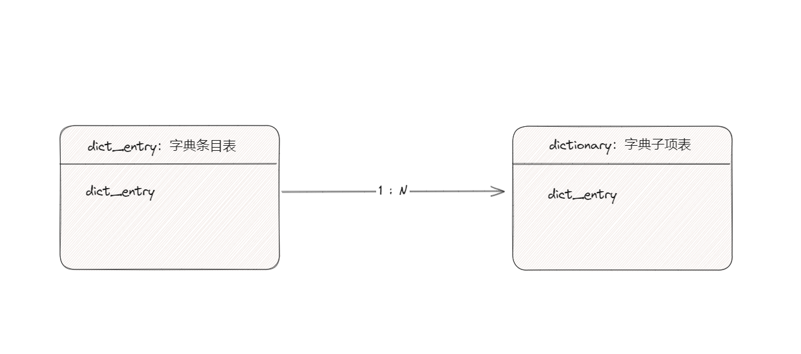

# 前言

<font face="幼圆">

> 字典表设计及实现

</font>

# 字典表结构

```sql
CREATE TABLE IF NOT EXISTS `dict_entry` (
  `dict_entry` int NOT NULL DEFAULT '0' COMMENT '字典条目编号',
  `entry_name` varchar(255) DEFAULT NULL COMMENT '字典条目名称',
  `remark` varchar(2000) DEFAULT NULL COMMENT '备注',
  `enabled_flag` char(1) NOT NULL DEFAULT '1' COMMENT '是否启用',
  PRIMARY KEY (`dict_entry`)
) ENGINE=InnoDB DEFAULT CHARSET=utf8 COMMENT='字典条目表'
```
--- 

```sql
CREATE TABLE IF NOT EXISTS `dictionary` (
  `dict_entry` int NOT NULL DEFAULT '0' COMMENT '字典条目编号',
  `sub_entry` varchar(255) CHARACTER SET utf8 COLLATE utf8_bin NOT NULL DEFAULT ' ' COMMENT '字典子项编号',
  `sub_entry_name` varchar(255) DEFAULT NULL COMMENT '字典子项名称',
  `sort_num` int DEFAULT '0' COMMENT '条目排序',
  `remark` varchar(2000) DEFAULT ' ' COMMENT '备注',
  `enabled_flag` char(1) NOT NULL DEFAULT '1' COMMENT '是否启用',
  PRIMARY KEY (`dict_entry`,`sub_entry`)
) ENGINE=InnoDB DEFAULT CHARSET=utf8 COMMENT='字典子项表'
```
---

<font face="幼圆">

> 字典条目表 `1:N`关系 字典子项表

</font>




# 查询字典数据

```sql
SELECT t1.dict_entry,
       t1.entry_name,
       t2.sub_entry,
       t2.sub_entry_name,
       t2.enabled_flag,
       t2.sort_num
FROM dict_entry t1
INNER JOIN dictionary t2 ON t1.dict_entry = t2.dict_entry
WHERE t1.dict_entry=''
```

# Redis缓存结构

<font face="幼圆">

> 字典条目编号作为Redis的key > alibaba:meta_data:dict_info:1001

</font>

```json 
{
  "0": {
    "entry_name": "季节",
    "dict_entry": 1001,
    "remark": " ",
    "sub_entry_name": "春天",
    "enabled_flag": "1",
    "sort_num": 0,
    "sub_entry": "0",
    "sub_entry_name_en": " "
  },
  "1": {
    "entry_name": "季节",
    "dict_entry": 1001,
    "remark": " ",
    "sub_entry_name": "夏天",
    "enabled_flag": "1",
    "sort_num": 0,
    "sub_entry": "1",
    "sub_entry_name_en": " "
  },
  "2": {
    "entry_name": "季节",
    "dict_entry": 1001,
    "remark": " ",
    "sub_entry_name": "秋天",
    "enabled_flag": "1",
    "sort_num": 0,
    "sub_entry": "2",
    "sub_entry_name_en": " "
  },
  "3": {
    "entry_name": "季节",
    "dict_entry": 1001,
    "remark": " ",
    "sub_entry_name": "冬天",
    "enabled_flag": "1",
    "sort_num": 0,
    "sub_entry": "3",
    "sub_entry_name_en": " "
  }
}
```

