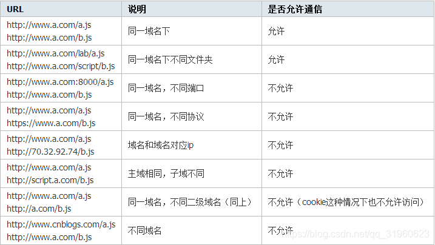

### 什么是跨域

跨域：指的是浏览器不能执行其他网站的脚本，它是由浏览器的同源策略造成的，是浏览器对 **javascript** 施加的安全限制

例如：**a** 页面想获取b页面资源，如果 **a、b** 页面的协议、域名、端口、子域名不同，所进行的访问行动都是跨域的，而浏览器为了安全问题一般都限制了跨域访问，也就是不允许跨域请求资源

注意：跨域限制访问，其实是浏览器的限制，理解这一点很重要 !!!

同源策略：是指协议，域名，端口都要相同，其中有一个不同都会产生跨域




### java 解决 CORS 跨域请求的方式

对于CORS的跨域请求，主要有以下几种方式可供选择：

- 返回新的CorsFilter
- 重写 WebMvcConfigurer
- 使用注解 @CrossOrigin
- 手动设置响应头 (HttpServletResponse)
- 自定义web filter 实现跨域

> CorFilter / WebMvConfigurer / @CrossOrigin 需要 SpringMVC 4.2以上版本才支持，对应springBoot 1.3版本以上
> 
> 上面前两种方式属于全局 CORS 配置，后两种属于局部 CORS 配置。如果使用了局部跨域是会覆盖全局跨域的规则，所以可以通过 @CrossOrigin 注解来进行细粒度更高的跨域资源控制
> 
> 其实无论哪种方案，最终目的都是修改响应头，向响应头中添加浏览器所要求的数据，进而实现跨域


### 返回新的 CorsFilter (全局跨域)

在任意配置类，返回一个 新的 CorsFIlter Bean ，并添加映射路径和具体的CORS配置路径

```java
@Configuration
public class GlobalCorsConfig {

    @Bean
    public CorsFilter corsFilter() {
        //1. 添加 CORS配置信息
        CorsConfiguration config = new CorsConfiguration();
        //放行哪些原始域
        config.addAllowedOrigin("*");
        //是否发送 Cookie
        config.setAllowCredentials(true);
        //放行哪些请求方式
        config.addAllowedMethod("*");
        //放行哪些原始请求头部信息
        config.addAllowedHeader("*");
        //暴露哪些头部信息
        config.addExposedHeader("*");
        //2. 添加映射路径
        UrlBasedCorsConfigurationSource corsConfigurationSource = new UrlBasedCorsConfigurationSource();
        corsConfigurationSource.registerCorsConfiguration("/**",config);
        //3. 返回新的CorsFilter
        return new CorsFilter(corsConfigurationSource);
    }
}
```

### 重写 WebMvcConfigurer (全局跨域)

```java
@Configuration
public class CorsConfig implements WebMvcConfigurer {

    @Override
    public void addCorsMappings(CorsRegistry registry) {
        registry.addMapping("/**")
                //是否发送Cookie
                .allowCredentials(true)
                //放行哪些原始域
                .allowedOrigins("*")
                .allowedMethods(new String[]{"GET", "POST", "PUT", "DELETE"})
                .allowedHeaders("*")
                .exposedHeaders("*");
    }
}
```

### 使用注解 (局部跨域)

在控制器(类上)上使用注解 @CrossOrigin:，表示该类的所有方法允许跨域

```java
@RestController
@CrossOrigin(origins = "*")
public class HelloController {

    @RequestMapping("/hello")
    public String hello() {
        return "hello world";
    }
}
```

在方法上使用注解 @CrossOrigin:

```java
  @RequestMapping("/hello")
  @CrossOrigin(origins = "*")
   //@CrossOrigin(value = "http://localhost:8081") //指定具体ip允许跨域
  public String hello() {
        return "hello world";
  }
```

### 手动设置响应头(局部跨域)

使用 HttpServletResponse 对象添加响应头 (Access-Control-Allow-Origin) 来授权原始域，这里 Origin 的值也可以设置为 “*”,表示全部放行

```java
@RequestMapping("/index")
public String index(HttpServletResponse response) {

    response.addHeader("Access-Allow-Control-Origin","*");
    return "index";
}
```


### 自定义web filter 实现跨域

首先编写一个过滤器，可以起名字为 MyCorsFilter.java

```java
package cn.wideth.aop;

import java.io.IOException;
import javax.servlet.Filter;
import javax.servlet.FilterChain;
import javax.servlet.FilterConfig;
import javax.servlet.ServletException;
import javax.servlet.ServletRequest;
import javax.servlet.ServletResponse;
import javax.servlet.http.HttpServletResponse;
import org.springframework.stereotype.Component;

@Component
public class MyCorsFilter implements Filter {

  public void doFilter(ServletRequest req, ServletResponse res, 
  FilterChain chain) throws IOException, ServletException {
  
    HttpServletResponse response = (HttpServletResponse) res;
    response.setHeader("Access-Control-Allow-Origin", "*");
    response.setHeader("Access-Control-Allow-Methods", "POST, GET, OPTIONS, DELETE");
    response.setHeader("Access-Control-Max-Age", "3600");
    response.setHeader("Access-Control-Allow-Headers", "x-requested-with,content-type");
    chain.doFilter(req, res);
    
  }
  
  public void init(FilterConfig filterConfig) {}
  public void destroy() {}
}
```

### 小结

> 介绍了 **SpringBoot** 解决跨域的 **5** 种方式，本人使用最多的是第三种
