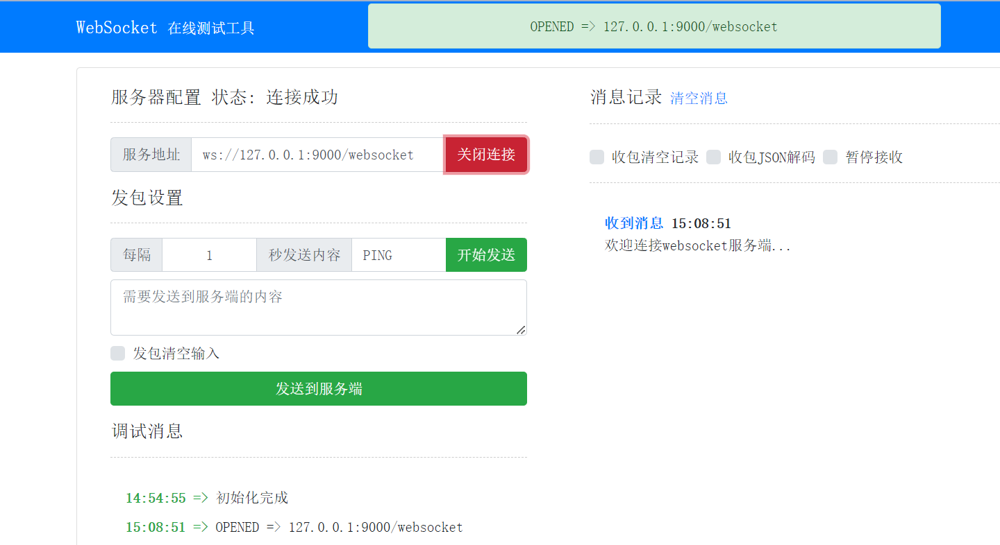
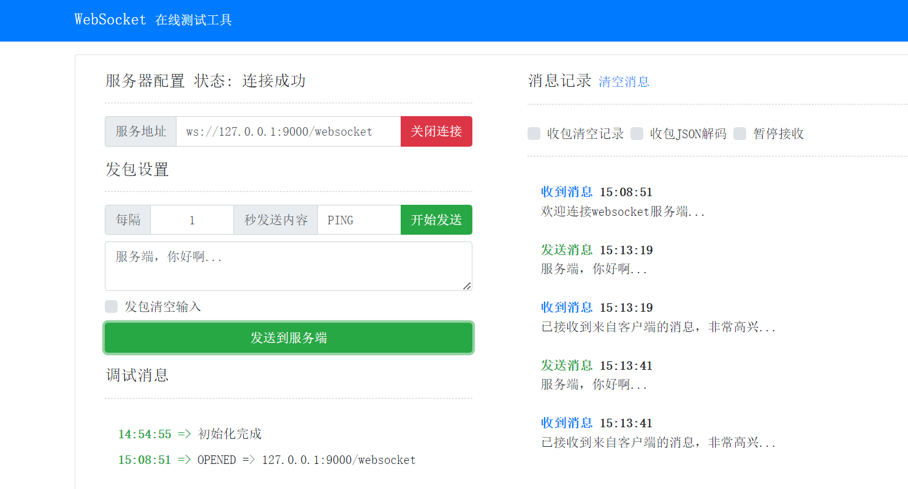
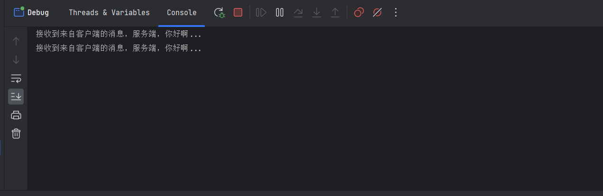

# 前言

<font face="幼圆">

> `spring-boot`集成`websocket`

</font>

# 项目结构

```text
├─config
│      MyWebsocketConfig.java
│
├─handler
│      MyWebsocketHandler.java
│
└─interceptor
        MyWebsocketInterceptor.java
```

# 依赖

```xml
<!-- websocket -->
<dependency>
    <groupId>org.springframework.boot</groupId>
    <artifactId>spring-boot-starter-websocket</artifactId>
</dependency>
```

# application.properties配置

```yaml
# 应用名称
spring.application.name=frame
  # 应用服务 WEB 访问端口
server.port=9000
```

# websocket-handler处理器

<font face="幼圆">

> `MyWebsocketHandler`类似于`spring-mvc`模式的`Controller`处理器

</font>

```java
package com.alibaba.frame.websocket.handler;
import org.springframework.stereotype.Component;
import org.springframework.web.socket.CloseStatus;
import org.springframework.web.socket.TextMessage;
import org.springframework.web.socket.WebSocketSession;
import org.springframework.web.socket.handler.TextWebSocketHandler;

/**
 * @author hspcadmin
 * @version 1.0
 * @description websocket处理器
 */
@Component
public class MyWebsocketHandler extends TextWebSocketHandler {

	@Override
	protected void handleTextMessage(WebSocketSession session, TextMessage message) throws Exception {

		final String payload = message.getPayload();
		System.out.println("接收到来自客户端的消息，" + payload);

		// 向客户端发送消息
		session.sendMessage(new TextMessage("已接收到来自客户端的消息，非常高兴..."));
	}

	@Override
	public void afterConnectionEstablished(WebSocketSession session) throws Exception {
		session.sendMessage(new TextMessage("欢迎连接websocket服务端..."));
	}

	@Override
	public void afterConnectionClosed(WebSocketSession session, CloseStatus status) throws Exception {
		System.out.println("websocket服务已断开...");
	}
}
```

# websocket-interceptor拦截器

```java 
package com.alibaba.frame.websocket.interceptor;
import org.springframework.http.server.ServerHttpRequest;
import org.springframework.http.server.ServerHttpResponse;
import org.springframework.stereotype.Component;
import org.springframework.web.socket.WebSocketHandler;
import org.springframework.web.socket.server.HandshakeInterceptor;
import java.util.Map;

/**
 * @author hspcadmin
 * @version 1.0
 * @description websocket拦截器
 */
@Component
public class MyWebsocketInterceptor implements HandshakeInterceptor {


	/**
	 * 建立连接之前拦截，返回false，则不建立连接
	 *
	 * @param request    the current request
	 * @param response   the current response
	 * @param wsHandler  the target WebSocket handler
	 * @param attributes attributes from the HTTP handshake to associate with the WebSocket
	 *                   session; the provided attributes are copied, the original map is not used.
	 * @return
	 * @throws Exception
	 */
	@Override
	public boolean beforeHandshake(ServerHttpRequest request,//
								   ServerHttpResponse response,//
								   WebSocketHandler wsHandler, //
								   Map<String, Object> attributes) throws Exception {

		return true;
	}

	/**
	 * 建立连接之后拦截
	 *
	 * @param request   the current request
	 * @param response  the current response
	 * @param wsHandler the target WebSocket handler
	 * @param exception an exception raised during the handshake, or {@code null} if none
	 */
	@Override
	public void afterHandshake(ServerHttpRequest request, //
							   ServerHttpResponse response,//
							   WebSocketHandler wsHandler,//
							   Exception exception) {

	}
}
```

# websocket-configuration配置类

```java 
package com.alibaba.frame.websocket.config;
import com.alibaba.frame.websocket.interceptor.MyWebsocketInterceptor;
import com.alibaba.frame.websocket.handler.MyWebsocketHandler;
import org.springframework.context.annotation.Configuration;
import org.springframework.web.socket.config.annotation.EnableWebSocket;
import org.springframework.web.socket.config.annotation.WebSocketConfigurer;
import org.springframework.web.socket.config.annotation.WebSocketHandlerRegistry;
import javax.annotation.Resource;

/**
 * @author hspcadmin
 * @version 1.0
 * @description websocket配置
 */
@Configuration
@EnableWebSocket
public class MyWebsocketConfig implements WebSocketConfigurer {
	@Resource
	private MyWebsocketHandler myWebsocketHandler;

	/**
	 * 注册处理器，设置跨域
	 *
	 * @param registry
	 */
	@Override
	public void registerWebSocketHandlers(WebSocketHandlerRegistry registry) {
		// 注册处理器
		registry.addHandler(myWebsocketHandler, "/websocket")
				// 注册拦截器
				.addInterceptors(new MyWebsocketInterceptor())
				// 设置跨域
				.setAllowedOrigins("*");
	}
}
```

# websocket连接测试

<font face="幼圆">

> `websocket`在线测试工具 http://wstool.js.org/

</font>



---



---




