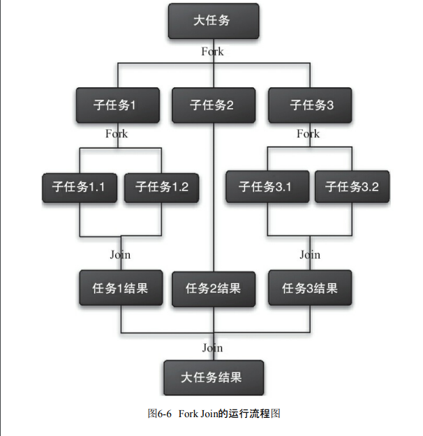

# 前言

<font face="幼圆">

> `Fork/Join`框架

</font>

# 概述

<font face="幼圆">

> `Fork/Join`框架是`Java7`提供的一个用于并行执行任务的框架，是一个把大任务分割成若干个小任务，最终汇总每个小任务结果后得到大任务结果的框架。
> 
> 通过`Fork`和`Join`这两个单词来理解一下`Fork/Join`框架。`Fork`就是把一个大任务切分为若干子任务并行的执行，`Join`就是合并这些子任务的执行结果，最后得到这个大任务的结果。
> 比如计算`1+2+ … +10000`，可以分割成`10`个子任务，每个子任务分别对`1000`个数进行求和，最终汇总这`10`个子任务的结果

</font>

<font face="幼圆">

> `Fork/Join`的运行流程如图:

</font>




# 使用Fork/Join框架

<font face="幼圆">

> 使用`Fork/Join`框架首先要考虑到的是如何分割任务，如果希望每个子任务最多执行两个数的相加，那么我们设置分割的阈值是`2`。

> 由于是`10`个数字相加，所以`Fork/Join`框架会把主任务`fork`成 `2` 个子任务，`子任务1`负责计算`0 - 5`数字的求和，`子任务2`负责计算`6 - 10`数字的求和，然后再`join`两个子任务的结果。

> `子任务1`区间的数量大于阈值`2`，又可以继续拆分出`2`个子任务，`子任务1.1`负责计算`0 - 2`数字的求和，`子任务1.2`负责计算`3 - 5`数字的求和，然后再`join`两个子任务的结果。

> `子任务2`区间的数量大于阈值`2`，又可以继续拆分出`2`个子任务，`子任务2.1`负责计算`6 - 8`数字的求和，`子任务2.2`负责计算`9 - 10`数字的求和，然后再`join`两个子任务的结果。

</font>

```java 
package com.alibaba.frame.b;
import java.util.concurrent.ForkJoinPool;
import java.util.concurrent.ForkJoinTask;
import java.util.concurrent.RecursiveTask;

/**
 * @author hspcadmin
 * @version 1.0
 * @description ForkJoin并行任务框架
 */
public class B_111 {
	public static void main(String[] args) throws Exception {

		final ForkJoinPool forkJoinPool = new ForkJoinPool();
		final SubTask subTask = new SubTask(0, 10);
		final ForkJoinTask<Integer> forkJoinTask = forkJoinPool.submit(subTask);
		final Integer result = forkJoinTask.get();
		System.out.println("result = " + result);

	}

	static class SubTask extends RecursiveTask<Integer> {
		// 阈值，用于是否要拆分任务
		private static final int taskAvg = 2;
		private int start;
		private int end;

		public SubTask(int start, int end) {
			this.start = start;
			this.end = end;
		}

		@Override
		protected Integer compute() {
			int numInt = 0;
			// 如果任务足够小就计算任务
			if ((end - start) <= taskAvg) {
				for (int i = start; i <= end; i++) {
					numInt += i;
				}
			} else {
				// 如果任务大于阈值，就分裂成两个子任务计算
				final int avg = (start + end) / taskAvg;
				final SubTask subTask1 = new SubTask(start, avg);
				final SubTask subTask2 = new SubTask(avg + 1, end);
				// 执行子任务
				subTask1.fork();
				subTask2.fork();
				// 等待子任务执行完，并得到其结果
				final Integer join1 = subTask1.join();
				final Integer join2 = subTask2.join();
				// 合并子任务计算的结果
				numInt = join1 + join2;
			}
			return numInt;
		}
	}
}
```
---

<font face="幼圆">

> 控制台

</font>

```text
result = 55
```

<font face="幼圆">

> 通过这个例子，我们进一步了解`ForkJoinTask`，`ForkJoinTask`与一般任务的主要区别在于它需要实现`compute`方法，在这个方法里，首先需要判断任务是否足够小，如果足够小就直接执行任务。
> 如果不足够小，就必须分割成两个子任务，每个子任务在调用`fork`方法时，又会进入`compute`方法，看看当前子任务是否需要继续分割成子任务，如果不需要继续分割，则执行当前子任务并返回结果。
> 使用`join`方法会等待子任务执行完并得到其结果。

</font>


