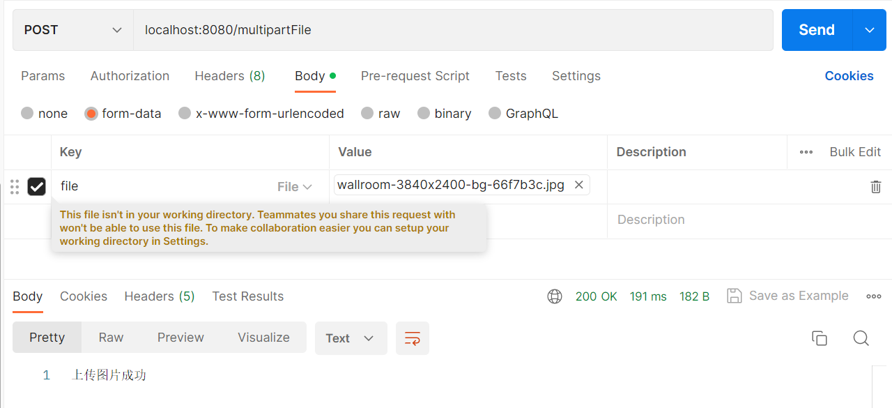

# 前言

<font face="幼圆">

> `springBoot`上传图片入门

</font>

# pom.xml依赖

```xml

<dependencies>
    <dependency>
        <groupId>org.springframework.boot</groupId>
        <artifactId>spring-boot-starter-web</artifactId>
        <!-- springBoot默认集成logback日志，需排除掉该依赖 -->
        <exclusions>
            <exclusion>
                <groupId>org.springframework.boot</groupId>
                <artifactId>spring-boot-starter-logging</artifactId>
            </exclusion>
        </exclusions>
    </dependency>

    <!-- 引入log4j2依赖 -->
    <dependency>
        <groupId>org.springframework.boot</groupId>
        <artifactId>spring-boot-starter-log4j2</artifactId>
    </dependency>
</dependencies>
```

# log4j2日志配置

```xml
<?xml version="1.0" encoding="UTF-8" ?>
<configuration status="warn">
    <properties>
        <property name="LOG_HOME">./log</property>
    </properties>

    <Appenders>
        <!-- 输出控制台，SYSTEM_OUT输出黑色，SYSTEM_ERR输出红色 -->
        <Console name="ConsoleAppender" target="SYSTEM_OUT">
            <!-- 日志输出格式 -->
            <PatternLayout pattern="%d{yyyy-MM-dd HH:mm:ss} [%t] [%-5level] %c{6} -| %m%n"/>
        </Console>

        <!-- 输出到文件 -->
        <File name="FileAppender" fileName="${LOG_HOME}/biz-info.log">
            <PatternLayout pattern="%d{yyyy-MM-dd HH:mm:ss} [%t] [%-5level] %c{6} -| %m%n"/>
        </File>
    </Appenders>

    <Loggers>
        <!--  设置additivity=true，除了输出到文件中，也要传递给父级RootLogger输出到控制台中 -->
        <Logger name="com.alibaba.frame" level="info" includeLocation="false" additivity="true">
            <AppenderRef ref="FileAppender"/>
        </Logger>

        <Root level="info">
            <!-- RootLogger输出到控制台 -->
            <AppenderRef ref="ConsoleAppender"/>
        </Root>
    </Loggers>
</configuration>
```

# application.properties配置

```yaml
# 应用名称
spring.application.name=frame
# 应用服务 WEB 访问端口
server.port=8080
#
# 设置上传单文件大小最大值 (SpringBoot2.x版本上配置路径)
spring.servlet.multipart.max-file-size=10MB
# 设置上传多文件大小最大值 (SpringBoot2.x版本上配置路径)
spring.servlet.multipart.max-request-size=100MB
```

# 入门示例

```java
package com.alibaba.frame.http.controller;
import lombok.Data;
import org.slf4j.Logger;
import org.slf4j.LoggerFactory;
import org.springframework.http.RequestEntity;
import org.springframework.http.ResponseEntity;
import org.springframework.util.StreamUtils;
import org.springframework.web.bind.annotation.PostMapping;
import org.springframework.web.bind.annotation.RequestParam;
import org.springframework.web.bind.annotation.RestController;
import org.springframework.web.multipart.MultipartFile;
import java.io.FileOutputStream;
import java.io.IOException;
import java.io.InputStream;
import java.util.Optional;

/**
 * @author hspcadmin
 * @version 1.0
 * @description
 */
@RestController
public class EntityController {
	private static final Logger logger = LoggerFactory.getLogger(EntityController.class);

	/**
	 * 上传图片
	 *
	 * @param file file
	 * @return ResponseEntity
	 */
	@PostMapping("/multipartFile")
	public ResponseEntity<String> multipartFile(@RequestParam("file") MultipartFile file) {
		if (file.isEmpty()) {
			return ResponseEntity.ok("请上传图片");
		}

		try (FileOutputStream os = new FileOutputStream("D:\\a.jpg")) {
			InputStream is = file.getInputStream();
			StreamUtils.copy(is, os);
		} catch (IOException e) {
			logger.error("上传图片报错：{}", e.toString());
			return ResponseEntity.ok("上传图片失败");
		}
		return ResponseEntity.ok("上传图片成功");
	}
}
```
# postman测试

<font face="幼圆">

> 上传图片，post请求，选择body，选择form-data，填写参数key，key类型选择file类型，value选择上传图片

</font>




<font face="幼圆">

> 以上示例上传图片后，保存图片的策略选择存在本地

</font>
