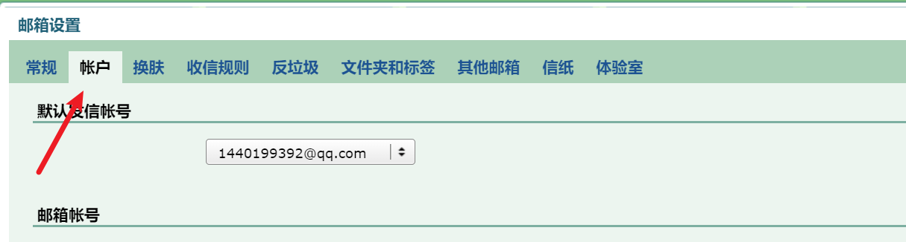
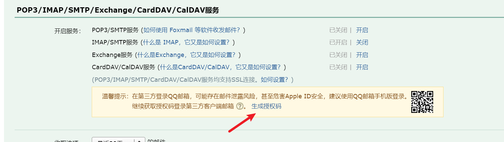
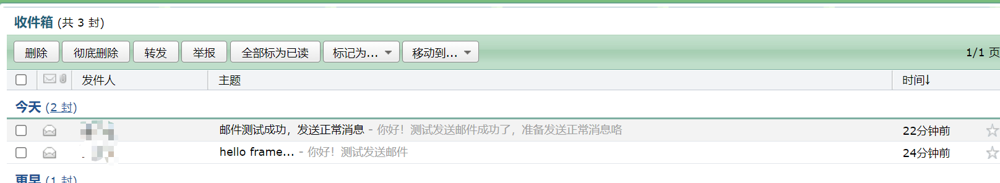

# 前言

<font face="幼圆">

> `springBoot`发送邮件入门

</font>

# pom.xml依赖

```java 
<!-- spring-boot 整合邮件 -->
<dependency>
    <groupId>org.springframework.boot</groupId>
    <artifactId>spring-boot-starter-mail</artifactId>
</dependency>
<dependency>
    <groupId>com.sun.mail</groupId>
    <artifactId>jakarta.mail</artifactId>
    <scope>compile</scope>
</dependency>
```

# application.properties配置

```yaml
############## 邮件配置 ##############
# 配置你发邮件的账号
spring.mail.username=1440199392@qq.com
# 注意，这里不是密码，是授权码
spring.mail.password=
spring.mail.host=smtp.qq.com
#开启加密规则
spring.mail.properties.mail.smtp.ssl.enable=true
```

---

<font face="幼圆">

> `qq`授权码获取

</font>




# 代码

```java 
package com.alibaba.frame;
import org.junit.jupiter.api.Test;
import org.springframework.beans.factory.annotation.Autowired;
import org.springframework.boot.test.context.SpringBootTest;
import org.springframework.mail.javamail.JavaMailSenderImpl;
import org.springframework.mail.javamail.MimeMessageHelper;
import javax.mail.MessagingException;
import javax.mail.internet.MimeMessage;

/**
 * @author hspcadmin
 * @version 1.0
 * @description
 */
@SpringBootTest
public class FrameApplicationTest3 {
	@Autowired
	JavaMailSenderImpl javaMailSender;

	@Test
	void test01() throws MessagingException {

		final MimeMessage message = javaMailSender.createMimeMessage();
		final MimeMessageHelper helper = new MimeMessageHelper(message, true);
		// 标题
		helper.setSubject("邮件测试成功，发送正常消息");
		// 内容
		helper.setText("你好！测试发送邮件成功了，准备发送正常消息咯", false);
		// 发送方
		helper.setFrom("1440199392@qq.com");
		// 接收方
		helper.setTo("1440199392@qq.com");
		javaMailSender.send(message);
	}
}
```

---

<font face="幼圆">

> 发送邮件成功，如图：

</font>


