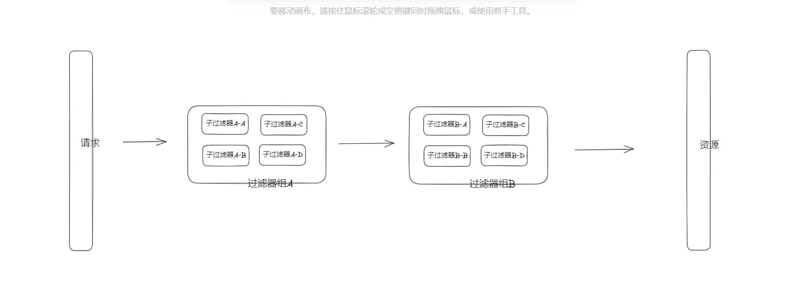

# 前言

<font face="幼圆">

> 组合过滤器Filter
> > 将`Filter`校验类型进行分组，每个分组内有多个`Filter`，这样显得更有层次。
> 
> 场景：
> > 比如一个请求，当前接口调用下游多个服务进行业务校验；每个下游服务的校验包含调用多个接口的校验；把每个下游服务抽象成一个过滤器组，下游服务的每个接口校验是一个过滤器，每个接口的校验相互隔离。
> >
> > 增加对下游服务的业务校验，只需要扩展出一个过滤器组，然后组内添加接口过滤器。
> 
>  参考 org.springframework.web.filter.CompositeFilter

</font>

--- 




# 过滤器Filter

```java 
interface Filter {

    void doFilter(Object model, FilterChain filterChain);
}
```

# 子过滤器：参数校验

```java 
// 子过滤器：参数校验
static class ParameterFilter implements Filter {

    @Override
    public void doFilter(Object model, FilterChain filterChain) {
        // 实现自己的逻辑
        System.out.println("子过滤器：参数校验 -> " + model);

        // 过滤器链上下文继续执行
        filterChain.doFilter(model);
    }

    public static ParameterFilter getInstance() {
        return new ParameterFilter();
    }
}
```

# 子过滤器：认证校验

```java 
// 子过滤器：认证校验
static class AuthFilter implements Filter {

    @Override
    public void doFilter(Object model, FilterChain filterChain) {
        // 实现自己的逻辑
        System.out.println("子过滤器：认证校验 -> " + model);

        // 过滤器链上下文继续执行
        filterChain.doFilter(model);
    }

    public static AuthFilter getInstance() {
        return new AuthFilter();
    }
}
```

# 组过滤器，用于维护多个子过滤器

```java 
// 组过滤器，用于维护多个子过滤器
static class GroupFilter implements Filter {
    // 维护子过滤器集合
    private final List<Filter> filters;

    @Override
    public void doFilter(Object model, FilterChain filterChain) {

        // 创建子过滤器上下文，执行上下文里的子过滤器
        FilterChainWrapper.getInstance(filters).doFilter(model);

        // 组过滤器上下文，继续执行下个组过滤器
        filterChain.doFilter(model);
    }

    private GroupFilter(List<Filter> filters) {
        this.filters = filters;
    }

    public static GroupFilter getInstance(List<Filter> filters) {
        return new GroupFilter(filters);
    }
}
```

# 组过滤器2，用于维护多个子过滤器

```java 
// 组过滤器2，用于维护多个子过滤器
static class Group2Filter implements Filter {
    // 维护子过滤器集合
    private final List<Filter> filters;

    @Override
    public void doFilter(Object model, FilterChain filterChain) {

        // 创建子过滤器上下文，执行上下文里的子过滤器
        FilterChainWrapper.getInstance(filters).doFilter(model);
    }

    private Group2Filter(List<Filter> filters) {
        this.filters = filters;
    }

    public static Group2Filter getInstance(List<Filter> filters) {
        return new Group2Filter(filters);
    }
}
```

# 策略链

```java 
interface FilterChain {

    void doFilter(Object model);
}
```

# 策略链组：维护多个组过滤器上下文

```java 
// 策略链组：维护多个组过滤器上下文
static class GroupFilterChainWrapper implements FilterChain {
    // 维护组过滤器组合
    private final List<Filter> filters;
    // 记录当前执行到第几个 Filter 的坐标
    private static final ThreadLocal<Integer> positionLocal = ThreadLocal.withInitial(() -> 0);

    @Override
    public void doFilter(Object model) {
        // 当前执行的组过滤器 Filter 坐标
        Integer position = positionLocal.get();

        if (position < filters.size()) {
            // 下次要执行的组过滤器 Filter 坐标
            position++;
            positionLocal.set(position);

            Filter filter = filters.get(position - 1);
            filter.doFilter(model, this);
        } else {
            // 责任链执行完，清除ThreadLocal，避免内存泄露
            this.reset();
        }
    }

    private GroupFilterChainWrapper(List<Filter> filters) {
        this.filters = filters;
    }

    public static GroupFilterChainWrapper getInstance(List<Filter> filters) {
        return new GroupFilterChainWrapper(filters);
    }

    // 责任链执行完，清除ThreadLocal，避免内存泄露
    public void reset() {
        positionLocal.remove();
        positionLocal.set(0);
    }
}
```

# 策略链：子过滤器上下文

```java 
// 策略链：子过滤器上下文
static class FilterChainWrapper implements FilterChain {
    // 维护子过滤器集合
    private final List<Filter> filters;
    // 记录当前执行到第几个 Filter 的坐标
    private static final ThreadLocal<Integer> positionLocal = ThreadLocal.withInitial(() -> 0);


    @Override
    public void doFilter(Object model) {
        // 当前执行的 Filter 坐标
        Integer position = positionLocal.get();

        if (position < filters.size()) {
            // 下次要执行的 Filter 坐标
            position++;
            positionLocal.set(position);

            Filter filter = filters.get(position - 1);
            filter.doFilter(model, this);
        } else {
            // 责任链执行完，清除ThreadLocal，避免内存泄露
            this.reset();
        }
    }


    private FilterChainWrapper(List<Filter> filters) {
        this.filters = filters;
    }

    public static FilterChainWrapper getInstance(List<Filter> filters) {
        return new FilterChainWrapper(filters);
    }

    // 责任链执行完，清除ThreadLocal，避免内存泄露
    public void reset() {
        positionLocal.remove();
        positionLocal.set(0);
    }
}
```

# 控制台输出

```text
// 第一个过滤组 GroupFilter 下的 Filter 校验
子过滤器：参数校验 -> 请求发送消息
子过滤器：认证校验 -> 请求发送消息

// 第一个过滤组 GroupFilter2 下的 Filter 校验
子过滤器：参数校验 -> 请求发送消息
子过滤器：认证校验 -> 请求发送消息
```
