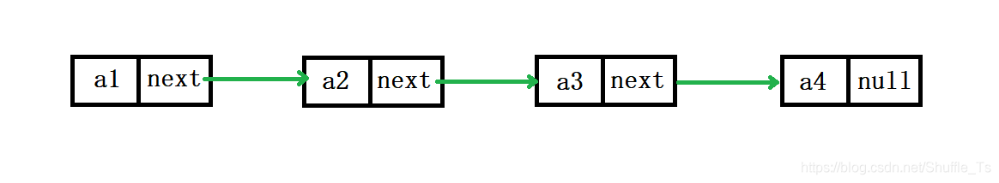

# 前言

<font face="幼圆">

> 伪代码模拟链表结构

</font>

# 链表的概念

<font face="幼圆">

> 链表的概念：
> > 链表是一种物理存储结构上非连续，非顺序的存储结构，数据元素的逻辑顺序是通过链表中的指针链接次序实现的

</font>



# 代码实现

```java 
package com.alibaba.frame;

public class NodeObj {
    private Object data;
    private NodeObj next;

    public static void main(String[] args) {

        NodeObj root = new NodeObj("父节点");
        root.setNext(new NodeObj("子节点"));
        root.getNext().setNext(new NodeObj("孙节点"));

        System.out.println(root);
    }

    public NodeObj(Object data) {
        this.data = data;
    }

    public void setNext(NodeObj next) {
        this.next = next;
    }

    public NodeObj getNext() {
        return next;
    }

    @Override
    public String toString() {
        return "NodeObj{" +
                "data=" + data +
                ", next=" + next +
                '}';
    }
}
```

---

<font face="幼圆">

> 控制台打印

</font>

```text
NodeObj{data=父节点, next=NodeObj{data=子节点, next=NodeObj{data=孙节点, next=null}}}
```

