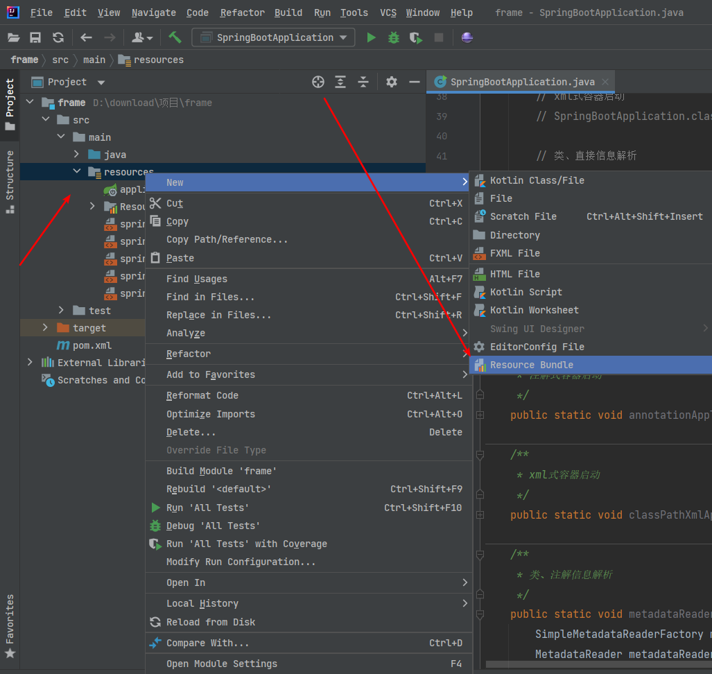
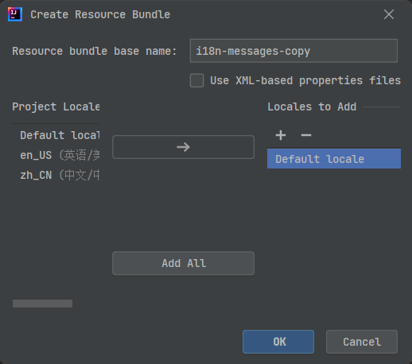
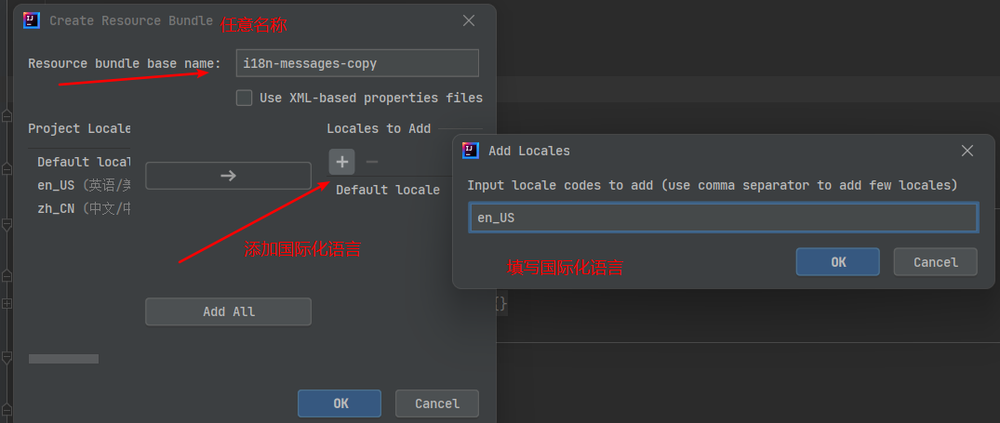
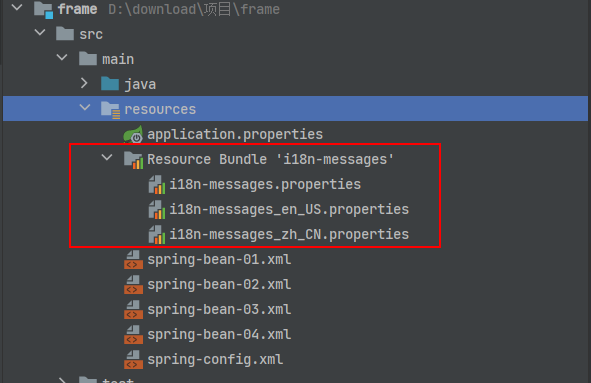

# 前言

<font face="幼圆">

> Spring 框架应用

</font>

# 注解式 AnnotationConfigApplicationContext 容器获取 Bean

## AnnotationConfigApplicationContext 指定加载 BeanConfiguration 配置类，获取 Bean

<font face="幼圆">

> AnnotationConfigApplicationContext 指定加载 BeanConfiguration 配置类，只会加载 BeanConfiguration 配置类里配置的 Bean

</font>

### 定义 Bean

```java 
package com.alibaba.frame.web.bean;
import lombok.Data;

@Data
public class User {
	private Integer userId = 1;
	private String userName = "admin";
}
```

---

```java 
package com.alibaba.frame.web.bean;
import lombok.Data;

@Data
public class Role {
	private Integer roleId = 1;
	private String roleName = "系统管理员";
}
```

### BeanConfiguration 配置类

```java 
package com.alibaba.frame.web.config;
import org.springframework.context.annotation.Bean;
import org.springframework.context.annotation.Configuration;
import com.alibaba.frame.web.bean.Role;
import com.alibaba.frame.web.bean.User;

@Configuration
public class BeanConfiguration {

	@Bean
	public User user() {
		return new User();
	}

	@Bean
	public Role role() {
		return new Role();
	}
}
```

### 测试 AnnotationConfigApplicationContext 容器获取 Bean

```java 
package com.alibaba.frame;
import java.io.IOException;
import org.springframework.context.annotation.AnnotationConfigApplicationContext;
import com.alibaba.frame.web.bean.Role;
import com.alibaba.frame.web.bean.User;
import com.alibaba.frame.web.config.BeanConfiguration;

public class SpringBootApplication {
	public static void main(String[] args) throws Exception {

		// 注解式容器启动
		SpringBootApplication.annotationApplicationContextRun();
	}

	/**
	 * 注解式容器启动
	 */
	public static void annotationApplicationContextRun() {
		// 注解式容器
		AnnotationConfigApplicationContext applicationContext = new AnnotationConfigApplicationContext(BeanConfiguration.class);
		User user = applicationContext.getBean(User.class);
		System.out.println(user);
		Role role = applicationContext.getBean(Role.class);
		System.out.println(role);
		applicationContext.close();
	}
}
```

### 控制台输出

```text 
User(userId=1, userName=admin)
Role(roleId=1, roleName=系统管理员)
```

## 定义 BeanDefinition，AnnotationConfigApplicationContext 获取 Bean

<font face="幼圆">

> 1、BeanDefinition 设置 Bean 信息，注册 BeanDefinition，根据 BeanDefinition 创建 Bean 实例
>
> 2、初始化 AnnotationConfigApplicationContext 的时候，指定加载 BeanConfiguration 配置类，其实可以不用加载它；指定加载是为了方便，无需手动注册、刷新操作了； AnnotationConfigApplicationContext 重载构造方法里有 注册 register(componentClasses)、刷新 refresh() 逻辑

</font>

### 定义 Bean

```java 
package com.alibaba.frame.web.bean;
import lombok.Data;
import org.springframework.beans.factory.DisposableBean;
import org.springframework.beans.factory.InitializingBean;

@Data
public class User{
	public static final String INIT_METHOD = "userInitMethod";
	public static final String DESTROY_METHOD = "userDestroyMethod";

	private Integer userId = 1;
	private String userName = "admin";

	public void userInitMethod() {
		System.out.println("----------------------- 执行初始化方法：User.userInitMethod -----------------------");
	}

	public void userDestroyMethod() {
		System.out.println("----------------------- 执行销毁方法：User.userDestroyMethod -----------------------");
	}
}
```

### BeanConfiguration 配置类

```java 
package com.alibaba.frame.web.config;
import org.springframework.context.annotation.Configuration;

@Configuration
public class BeanConfiguration {

}
```

### 测试 AnnotationConfigApplicationContext 容器获取 Bean

```java 
package com.alibaba.frame;
import java.beans.Introspector;
import org.springframework.beans.factory.config.BeanDefinition;
import org.springframework.beans.factory.support.AbstractBeanDefinition;
import org.springframework.beans.factory.support.BeanDefinitionBuilder;
import org.springframework.context.annotation.AnnotationConfigApplicationContext;
import com.alibaba.frame.web.bean.User;
import com.alibaba.frame.web.config.BeanConfiguration;

public class SpringBootApplication {
	public static void main(String[] args) throws Exception {

		// 注解式容器启动
		SpringBootApplication.annotationApplicationContextRun();
	}

	/**
	 * 注解式容器启动
	 */
	public static void annotationApplicationContextRun() {
	
		// 初始化容器
		AnnotationConfigApplicationContext applicationContext = new AnnotationConfigApplicationContext(BeanConfiguration.class);
		// BeanDefinitionBuilder，自定义构造BeanDefinition，设置Bean步骤 1 和 步骤 2 任选一项
		AbstractBeanDefinition beanDefinition = BeanDefinitionBuilder.genericBeanDefinition().getBeanDefinition();
		// 1、设置Bean的Class
		beanDefinition.setBeanClass(User.class);
		// 2、设置Bean的全限定名称
		beanDefinition.setBeanClassName("com.alibaba.frame.web.bean.User");
		// 3、设置作用域：单例、多例
		beanDefinition.setScope(BeanDefinition.SCOPE_PROTOTYPE);
		// 4、设置初始化方法
		beanDefinition.setInitMethodName(User.INIT_METHOD);
		// 5、设置销毁方法
		beanDefinition.setDestroyMethodName(User.DESTROY_METHOD);
		// 6、是否懒加载
		beanDefinition.setLazyInit(true);

		// 注册BeanDefinition
		applicationContext.registerBeanDefinition(SpringBootApplication.genericBeanName(User.class), beanDefinition);
		User user = applicationContext.getBean("user", User.class);
		System.out.println(user);
	}

	/**
	 * 1、生成 Bean 名称：User --> user
	 * 2、Spring 生成 Bean 名称的策略底层默认实现，就是 Introspector.decapitalize()
	 * 3、SSuser 类名前 2 位大写，生成 Bean 的名称依旧是 SSuser
	 * 4、User 类名首字母大写，生成 Bean 的名称依旧是 user
	 *
	 * @param clazz
	 * @return
	 */
	private static String genericBeanName(Class<?> clazz) {
		return Introspector.decapitalize(clazz.getSimpleName());
	}
}
```

### 控制台输出

```text 
----------------------- 执行初始化方法：User.afterPropertiesSet -----------------------
----------------------- 执行初始化方法：User.userInitMethod -----------------------
User(userId=1, userName=admin)
```

## AnnotationConfigApplicationContext 指定加载包路径，获取 Bean

### pom.xml

```xml 
<!-- JSR-330规范 -->
<dependency>
    <groupId>javax.inject</groupId>
    <artifactId>javax.inject</artifactId>
    <version>1</version>
</dependency>
```

### 定义 Bean

```java 
package com.alibaba.frame.web.bean;
import lombok.Data;
import org.springframework.beans.factory.DisposableBean;
import org.springframework.beans.factory.InitializingBean;
import javax.inject.Named;

@Data
@Named // JSR-330规范：Bean注入 等于 @Component
public class User implements InitializingBean, DisposableBean {
	private Integer userId = 1;
	private String userName = "admin";

	@Override
	public void destroy() throws Exception {
		System.out.println("----------------------- 执行销毁方法：User.destroy -----------------------");
	}

	@Override
	public void afterPropertiesSet() throws Exception {
		System.out.println("----------------------- 执行初始化方法：User.afterPropertiesSet -----------------------");
	}
}
```

### 测试 AnnotationConfigApplicationContext 指定加载包路径，获取 Bean

```java 
package com.alibaba.frame;
import org.springframework.context.annotation.AnnotationConfigApplicationContext;
import com.alibaba.frame.web.bean.User;

public class SpringBootApplication {

	public static void main(String[] args) throws Exception {

		// 注解式容器启动
		SpringBootApplication.annotationApplicationContextRun();
	}

	/**
	 * 注解式容器启动
	 */
	public static void annotationApplicationContextRun() {
	
		// 1、方式一：扫描路径，初始化容器，等同于注解 @ComponentScan("com.alibaba.frame.web")
		AnnotationConfigApplicationContext applicationContext = new AnnotationConfigApplicationContext("com.alibaba.frame.web");
		User user = applicationContext.getBean(User.class);
		System.out.println("user = " + user);
		applicationContext.close();
		
        // 2、方式二：扫描路径，初始化容器，等同于注解 @ComponentScan("com.alibaba.frame.web")
		AnnotationConfigApplicationContext applicationContext = new AnnotationConfigApplicationContext();
		applicationContext.scan("com.alibaba.frame.web");
		applicationContext.refresh();
		User user = applicationContext.getBean(User.class);
		System.out.println("user = " + user);
		applicationContext.close();
	}
}
```

### 控制台输出

```text 
----------------------- 执行初始化方法：User.afterPropertiesSet -----------------------
user = User(userId=1, userName=admin)
----------------------- 执行销毁方法：User.destroy -----------------------
```

##  注解 @Bean({"", "", ""}) 起多个别名

### 定义 Bean

```java 
package com.alibaba.frame.web.bean;
import lombok.Data;

@Data
public class Person {
	private Integer personId;
	private String personName;
}
```

### BeanConfiguration 配置类

```java 
package com.alibaba.frame.web.config;
import org.springframework.context.annotation.Bean;
import org.springframework.context.annotation.Configuration;
import com.alibaba.frame.web.bean.Person;

@Configuration
public class BeanConfiguration {

	 @Bean({"person", "person_01", "person_02"})
	 public Person person() {
	 return new Person();
	 }
}
```

### 测试注解 @Bean({"", "", ""}) 起多个别名

```java 
package com.alibaba.frame;
import org.springframework.context.annotation.AnnotationConfigApplicationContext;
import com.alibaba.frame.web.bean.Person;
import com.alibaba.frame.web.config.BeanConfiguration;


public class SpringBootApplication {
	public static void main(String[] args) throws Exception {

		// 注解式容器启动
		SpringBootApplication.annotationApplicationContextRun();
	}

	/**
	 * 注解式容器启动
	 */
	public static void annotationApplicationContextRun() {
	
		// 测试 @Bean({"person", "person_01", "person_02"}) 多个别名
		AnnotationConfigApplicationContext applicationContext = new AnnotationConfigApplicationContext(BeanConfiguration.class);
		Person person = applicationContext.getBean("person", Person.class);
		System.out.println(person);
		Person person_01 = applicationContext.getBean("person_01", Person.class);
		System.out.println(person_01);
		Person person_02 = applicationContext.getBean("person_02", Person.class);
		System.out.println(person_02);
		Person person_04 = applicationContext.getBean("person_04", Person.class);
		System.out.println(person_04);
	}
}
```

### 控制台输出

```text 
Person(personId=null, personName=null)
Person(personId=null, personName=null)
Person(personId=null, personName=null)
Exception in thread "main" org.springframework.beans.factory.NoSuchBeanDefinitionException: No bean named 'person_04' available
	at org.springframework.beans.factory.support.DefaultListableBeanFactory.getBeanDefinition(DefaultListableBeanFactory.java:874)
	at org.springframework.beans.factory.support.AbstractBeanFactory.getMergedLocalBeanDefinition(AbstractBeanFactory.java:1358)
	at org.springframework.beans.factory.support.AbstractBeanFactory.doGetBean(AbstractBeanFactory.java:309)
	at org.springframework.beans.factory.support.AbstractBeanFactory.getBean(AbstractBeanFactory.java:213)
	at org.springframework.context.support.AbstractApplicationContext.getBean(AbstractApplicationContext.java:1162)
	at com.alibaba.frame.SpringBootApplication.annotationApplicationContextRun(SpringBootApplication.java:142)
	at com.alibaba.frame.SpringBootApplication.main(SpringBootApplication.java:38)
```

# xml式 ClassPathXmlApplicationContext 容器获取 Bean

## ClassPathXmlApplicationContext 容器加载单个或者多个 xml 容器配置文件，获取 Bean

### xml容器配置文件

<font face="幼圆">

> xml容器配置文件放在 resources 目录下

</font>

```markdown 
├─src
│  ├─main
│  │  ├─java
│  │  │  └─com
│  │  │      └─alibaba
│  │  │          └─frame
│  │  │              │  SpringBootApplication.java
│  │  └─resources
│  │          application.properties
│  │          spring-bean-01.xml
│  │          spring-bean-02.xml
```

--- 

```xml 
<?xml version="1.0" encoding="UTF-8"?>
<beans xmlns="http://www.springframework.org/schema/beans"
       xmlns:xsi="http://www.w3.org/2001/XMLSchema-instance"
       xsi:schemaLocation="http://www.springframework.org/schema/beans
        https://www.springframework.org/schema/beans/spring-beans.xsd">

    <!-- 配置Student   -->
    <bean class="com.alibaba.frame.web.bean.Student" id="student" name="student" scope="singleton" init-method="studentInitMethod" destroy-method="studentDestroyMethod">
        <property name="studentId" value="1"/>
        <property name="studentName" value="小明同学"/>
    </bean>

    <!-- 配置Teacher   -->
    <bean class="com.alibaba.frame.web.bean.Teacher" id="teacher" name="teacher" scope="singleton" init-method="teacherInitMethod" destroy-method="teacherDestroyMethod">
        <property name="teacherId" value="1"/>
        <property name="teacherName" value="小英老师"/>
    </bean>
</beans>
```

---

```xml 
<?xml version="1.0" encoding="UTF-8"?>
<beans xmlns="http://www.springframework.org/schema/beans"
       xmlns:xsi="http://www.w3.org/2001/XMLSchema-instance"
       xsi:schemaLocation="http://www.springframework.org/schema/beans
        https://www.springframework.org/schema/beans/spring-beans.xsd">

    <!-- 配置Doctor   -->
    <bean class="com.alibaba.frame.web.bean.Doctor" id="doctor" name="doctor" scope="singleton" init-method="doctorInitMethod" destroy-method="doctorDestroyMethod">
        <property name="doctorId" value="1"/>
        <property name="doctorName" value="大刚子医生"/>
    </bean>
</beans>
```

### 定义 Bean

```java 
package com.alibaba.frame.web.bean;
import lombok.Data;

@Data
public class Student {
	public static final String INIT_METHOD = "studentInitMethod";
	public static final String DESTROY_METHOD = "studentDestroyMethod";

	private Integer studentId;
	private String studentName;


	public void studentInitMethod() {
		System.out.println("----------------------- 执行初始化方法：Student.studentInitMethod -----------------------");
	}

	public void studentDestroyMethod() {
		System.out.println("----------------------- 执行销毁方法：Student.studentDestroyMethod -----------------------");
	}
}
```

---

```java 
package com.alibaba.frame.web.bean;
import lombok.Data;

@Data
public class Teacher {
	public static final String INIT_METHOD = "teacherInitMethod";
	public static final String DESTROY_METHOD = "teacherDestroyMethod";

	private Integer teacherId;
	private String teacherName;


	public void teacherInitMethod() {
		System.out.println("----------------------- 执行初始化方法：Teacher.teacherInitMethod -----------------------");
	}

	public void teacherDestroyMethod() {
		System.out.println("----------------------- 执行销毁方法：Teacher.teacherDestroyMethod -----------------------");
	}
}
```

---

```java 
package com.alibaba.frame.web.bean;
import lombok.Data;

@Data
public class Doctor {
	public static final String INIT_METHOD = "doctorInitMethod";
	public static final String DESTROY_METHOD = "doctorDestroyMethod";

	private Integer doctorId;
	private String doctorName;

	public void doctorInitMethod() {
		System.out.println("----------------------- 执行初始化方法：Doctor.doctorInitMethod -----------------------");
	}

	public void doctorDestroyMethod() {
		System.out.println("----------------------- 执行销毁方法：Doctor.doctorDestroyMethod -----------------------");
	}
}
```

### 测试 ClassPathXmlApplicationContext 容器加载单个或者多个 xml 容器配置文件，获取 Bean

```java 
package com.alibaba.frame;
import org.springframework.context.support.ClassPathXmlApplicationContext;
import com.alibaba.frame.web.bean.Student;
import com.alibaba.frame.web.bean.Teacher;

public class SpringBootApplication {
	public static void main(String[] args) throws Exception {

		// xml式容器启动
		SpringBootApplication.classPathXmlApplicationContextRun();
	}

	/**
	 * xml式容器启动
	 */
	public static void classPathXmlApplicationContextRun() {

		// 加载多个xml容器文件
		ClassPathXmlApplicationContext applicationContext = new ClassPathXmlApplicationContext("spring-bean-01.xml", "spring-bean-02.xml");
		Student student = applicationContext.getBean(Student.class);
		System.out.println(student);
		Teacher teacher = applicationContext.getBean(Teacher.class);
		System.out.println(teacher);
		Doctor doctor = applicationContext.getBean(Doctor.class);
		System.out.println(doctor);
		applicationContext.close();
	}
}
```

### 控制台输出

```text 
----------------------- 执行初始化方法：Student.studentInitMethod -----------------------
----------------------- 执行初始化方法：Teacher.teacherInitMethod -----------------------
student = Student(studentId=1, studentName=小明同学)
Teacher(teacherId=1, teacherName=小英老师)
----------------------- 执行销毁方法：Teacher.teacherDestroyMethod -----------------------
----------------------- 执行销毁方法：Student.studentDestroyMethod -----------------------
```

## ClassPathXmlApplicationContext 容器指定加载 spring-config.xml 导入多个 xml 容器文件，获取 Bean

### xml容器配置文件

<font face="幼圆">

> xml容器配置文件放在 resources 目录下

</font>

```markdown 
├─src
│  ├─main
│  │  ├─java
│  │  │  └─com
│  │  │      └─alibaba
│  │  │          └─frame
│  │  │              │  SpringBootApplication.java
│  │  └─resources
│  │          application.properties
│  │          i18n-messages.properties
│  │          i18n-messages_en_US.properties
│  │          i18n-messages_zh_CN.properties
│  │          spring-bean-01.xml
│  │          spring-bean-02.xml
│  │          spring-bean-03.xml
│  │          spring-bean-04.xml
│  │          spring-config.xml
```

--- 

```xml 
<?xml version="1.0" encoding="UTF-8"?>
<beans xmlns="http://www.springframework.org/schema/beans"
       xmlns:xsi="http://www.w3.org/2001/XMLSchema-instance"
       xsi:schemaLocation="http://www.springframework.org/schema/beans
        https://www.springframework.org/schema/beans/spring-beans.xsd">

    <!-- 加载多个XML配置文件 -->
    <import resource="spring-bean-01.xml"/>
    <import resource="spring-bean-02.xml"/>
    <import resource="spring-bean-03.xml"/>
    <import resource="spring-bean-04.xml"/>
</beans>
```

---

```xml 
<?xml version="1.0" encoding="UTF-8"?>
<beans xmlns="http://www.springframework.org/schema/beans"
       xmlns:xsi="http://www.w3.org/2001/XMLSchema-instance"
       xsi:schemaLocation="http://www.springframework.org/schema/beans
        https://www.springframework.org/schema/beans/spring-beans.xsd">

    <!-- 配置别名 -->
    <alias name="student" alias="my-student"/>

    <!-- 配置Student   -->
    <bean class="com.alibaba.frame.web.bean.Student" id="my-student" name="my-student" scope="singleton" init-method="studentInitMethod" destroy-method="studentDestroyMethod">
        <property name="studentId" value="1"/>
        <property name="studentName" value="小明同学"/>
    </bean>

    <!-- 配置Teacher   -->
    <bean class="com.alibaba.frame.web.bean.Teacher" id="teacher" name="teacher" scope="singleton" init-method="teacherInitMethod" destroy-method="teacherDestroyMethod">
        <property name="teacherId" value="1"/>
        <property name="teacherName" value="小英老师"/>
    </bean>
</beans>
```

---

```xml 
<?xml version="1.0" encoding="UTF-8"?>
<beans xmlns="http://www.springframework.org/schema/beans"
       xmlns:xsi="http://www.w3.org/2001/XMLSchema-instance"
       xsi:schemaLocation="http://www.springframework.org/schema/beans
        https://www.springframework.org/schema/beans/spring-beans.xsd">

    <!-- 配置Doctor   -->
    <bean class="com.alibaba.frame.web.bean.Doctor" id="doctor" name="doctor" scope="singleton" init-method="doctorInitMethod" destroy-method="doctorDestroyMethod">
        <property name="doctorId" value="1"/>
        <property name="doctorName" value="大刚子医生"/>
    </bean>
</beans>
```

--- 

```xml 
<?xml version="1.0" encoding="UTF-8"?>
<beans xmlns="http://www.springframework.org/schema/beans"
       xmlns:xsi="http://www.w3.org/2001/XMLSchema-instance"
       xsi:schemaLocation="http://www.springframework.org/schema/beans
        https://www.springframework.org/schema/beans/spring-beans.xsd">

    <!--
        配置Order，用静态工厂方法进行实例化，在定义用静态工厂方法创建的Bean时，使用 class 属性来指定包含 static 工厂方法的类，并使用名为 factory-method 的属性来指定工厂 static 方法本身的名称
    -->
    <bean class="com.alibaba.frame.web.bean.Order" id="order" name="order" factory-method="getInstance" init-method="orderInitMethod" destroy-method="orderDestroyMethod">
        <property name="orderId" value="1"/>
        <property name="orderName" value="化妆品订单"/>
    </bean>

    <!--
        配置Book，实例工厂方法进行实例化，与 通过静态工厂方法进行的实例化类似，用实例工厂方法进行的实例化从容器中调用现有 bean 的非静态方法来创建一个新的 bean，
        要使用这种机制，请将 class 属性留空，并在 factory-bean 属性中指定当前（或父代或祖代）容器中的一个 Bean 的名称，
        该容器包含要被调用来创建对象的实例方法。用 factory-method 属性设置工厂方法本身的名称
    -->
    <bean id="book" name="book" factory-bean="customBeanFactory" factory-method="getBook" init-method="bookInitMethod" destroy-method="bookDestroyMethod">
        <property name="bookId" value="1"/>
        <property name="bookName" value="毛泽东选集"/>
    </bean>

    <!-- 配置工厂类CustomBeanFactory   -->
    <bean class="com.alibaba.frame.web.factory.CustomBeanFactory" id="customBeanFactory" name="customBeanFactory"/>
</beans>
```

---

```xml 
<?xml version="1.0" encoding="UTF-8"?>
<beans xmlns="http://www.springframework.org/schema/beans"
       xmlns:xsi="http://www.w3.org/2001/XMLSchema-instance"
       xsi:schemaLocation="http://www.springframework.org/schema/beans
        https://www.springframework.org/schema/beans/spring-beans.xsd">

    <!-- 配置Iphone，构造注入 -->
    <bean class="com.alibaba.frame.web.bean.Iphone" id="iphone" name="iphone" init-method="iphoneInitMethod" destroy-method="iphoneDestroyMethod">

        <!-- 构造函数参数名匹配 -->
        <!--        <constructor-arg name="iphoneId" value="1"/>-->
        <!--        <constructor-arg name="iphoneName" value="苹果手机"/>-->

        <!-- 构造函数参数类型匹配 -->
        <!--        <constructor-arg type="java.lang.Integer" value="1"/>-->
        <!--        <constructor-arg type="java.lang.String" value="苹果手机"/>-->

        <!-- 构造函数参数索引匹配-->
        <constructor-arg index="0" value="1"/>
        <constructor-arg index="1" value="苹果手机"/>
    </bean>
</beans>
```

### 定义 Bean

```java 
package com.alibaba.frame.web.bean;
import lombok.Data;

@Data
public class Student {
	public static final String INIT_METHOD = "studentInitMethod";
	public static final String DESTROY_METHOD = "studentDestroyMethod";

	private Integer studentId;
	private String studentName;

	public void studentInitMethod() {
		System.out.println("----------------------- 执行初始化方法：Student.studentInitMethod -----------------------");
	}

	public void studentDestroyMethod() {
		System.out.println("----------------------- 执行销毁方法：Student.studentDestroyMethod -----------------------");
	}
}
```

---

```java 
package com.alibaba.frame.web.bean;
import lombok.Data;

@Data
public class Teacher {
	public static final String INIT_METHOD = "teacherInitMethod";
	public static final String DESTROY_METHOD = "teacherDestroyMethod";

	private Integer teacherId;
	private String teacherName;

	public void teacherInitMethod() {
		System.out.println("----------------------- 执行初始化方法：Teacher.teacherInitMethod -----------------------");
	}

	public void teacherDestroyMethod() {
		System.out.println("----------------------- 执行销毁方法：Teacher.teacherDestroyMethod -----------------------");
	}
}
```

---

```java 
package com.alibaba.frame.web.bean;
import lombok.Data;

@Data
public class Doctor {
	public static final String INIT_METHOD = "doctorInitMethod";
	public static final String DESTROY_METHOD = "doctorDestroyMethod";

	private Integer doctorId;
	private String doctorName;

	public void doctorInitMethod() {
		System.out.println("----------------------- 执行初始化方法：Doctor.doctorInitMethod -----------------------");
	}

	public void doctorDestroyMethod() {
		System.out.println("----------------------- 执行销毁方法：Doctor.doctorDestroyMethod -----------------------");
	}
}
```

---

```java 
package com.alibaba.frame.web.bean;
import lombok.Data;

@Data
public class Order {
	public static final String INIT_METHOD = "orderInitMethod";
	public static final String DESTROY_METHOD = "orderDestroyMethod";
	private static final Order order = new Order();

	private Integer orderId;
	private String orderName;

	public void orderInitMethod() {
		System.out.println("----------------------- 执行初始化方法：Order.orderInitMethod -----------------------");
	}

	public void orderDestroyMethod() {
		System.out.println("----------------------- 执行销毁方法：Order.orderDestroyMethod -----------------------");
	}

	/**
	 * 单例
	 * @return
	 */
	public static Order getInstance() {
		return order;
	}
}
```

---

```java 
package com.alibaba.frame.web.bean;
import lombok.Data;

@Data
public class Book {
	public static final String INIT_METHOD = "bookInitMethod";
	public static final String DESTROY_METHOD = "bookDestroyMethod";

	private Integer bookId;
	private String bookName;

	public void bookInitMethod() {
		System.out.println("----------------------- 执行初始化方法：Book.bookInitMethod -----------------------");
	}

	public void bookDestroyMethod() {
		System.out.println("----------------------- 执行销毁方法：Book.bookDestroyMethod -----------------------");
	}
}
```

---

```java 
package com.alibaba.frame.web.factory;
import com.alibaba.frame.web.bean.Book;

/**
 * @description: Bean构建工厂
 * @author: admin
 * @date: 2023-07-15
 * @version: 1.0
 */
public class CustomBeanFactory {
	private static final Book book = new Book();

	public Book getBook() {
		return book;
	}
}
```

---

```java 
package com.alibaba.frame.web.bean;
import lombok.Data;

@Data
public class Iphone {
	public static final String INIT_METHOD = "iphoneInitMethod";
	public static final String DESTROY_METHOD = "iphoneDestroyMethod";

	private Integer iphoneId;
	private String iphoneName;

	public Iphone(Integer iphoneId, String iphoneName) {
		this.iphoneId = iphoneId;
		this.iphoneName = iphoneName;
	}

	public void iphoneInitMethod() {
		System.out.println("----------------------- 执行初始化方法：Iphone.iphoneInitMethod -----------------------");
	}

	public void iphoneDestroyMethod() {
		System.out.println("----------------------- 执行销毁方法：Iphone.iphoneDestroyMethod -----------------------");
	}

}
```

### 测试 ClassPathXmlApplicationContext 容器指定加载 spring-config.xml 导入多个 xml 容器文件，获取 Bean

```java 
package com.alibaba.frame;
import org.springframework.context.support.ClassPathXmlApplicationContext;
import com.alibaba.frame.web.bean.Book;
import com.alibaba.frame.web.bean.Doctor;
import com.alibaba.frame.web.bean.Iphone;
import com.alibaba.frame.web.bean.Order;
import com.alibaba.frame.web.bean.Student;
import com.alibaba.frame.web.bean.Teacher;

/**
 * @projectName: frame
 * @packageName: com.alibaba.frame
 * @className: SpringBootApplication
 * @description: SpringBootApplication启动类
 * @author: admin
 * @date: 2023-07-15
 * @version: 1.0
 */
public class SpringBootApplication {
	public static void main(String[] args) throws Exception {

		// xml式容器启动
		SpringBootApplication.classPathXmlApplicationContextRun();
	}

	/**
	 * xml式容器启动
	 */
	public static void classPathXmlApplicationContextRun() {

		// 加载spring-config.xml，导入多个xml容器文件
		ClassPathXmlApplicationContext applicationContext = new ClassPathXmlApplicationContext("spring-config.xml");
		Student student = applicationContext.getBean(Student.class);
		System.out.println(student);
		// 别名获取bean
		Object myStudent = applicationContext.getBean("my-student");
		System.out.println(myStudent);
		Teacher teacher = applicationContext.getBean(Teacher.class);
		System.out.println(teacher);
		Doctor doctor = applicationContext.getBean(Doctor.class);
		System.out.println(doctor);
		Order order = applicationContext.getBean(Order.class);
		System.out.println(order);
		Book book = applicationContext.getBean(Book.class);
		System.out.println(book);
		Iphone iphone = applicationContext.getBean(Iphone.class);
		System.out.println(iphone);
		applicationContext.close();
	}
}
```

### 控制台输出

```text 
----------------------- 执行初始化方法：Student.studentInitMethod -----------------------
----------------------- 执行初始化方法：Teacher.teacherInitMethod -----------------------
----------------------- 执行初始化方法：Doctor.doctorInitMethod -----------------------
----------------------- 执行初始化方法：Order.orderInitMethod -----------------------
----------------------- 执行初始化方法：Book.bookInitMethod -----------------------
----------------------- 执行初始化方法：Iphone.iphoneInitMethod -----------------------

Student(studentId=1, studentName=小明同学)
Student(studentId=1, studentName=小明同学)
Teacher(teacherId=1, teacherName=小英老师)
Doctor(doctorId=1, doctorName=大刚子医生)
Order(orderId=1, orderName=化妆品订单)
Book(bookId=1, bookName=毛泽东选集)
Iphone(iphoneId=1, iphoneName=苹果手机)

----------------------- 执行销毁方法：Iphone.iphoneDestroyMethod -----------------------
----------------------- 执行销毁方法：Book.bookDestroyMethod -----------------------
----------------------- 执行销毁方法：Order.orderDestroyMethod -----------------------
----------------------- 执行销毁方法：Doctor.doctorDestroyMethod -----------------------
----------------------- 执行销毁方法：Teacher.teacherDestroyMethod -----------------------
----------------------- 执行销毁方法：Student.studentDestroyMethod -----------------------
```

# 类、注解信息解析

## 定义 Bean

```java 
package com.alibaba.frame.web.controller;
import org.springframework.web.bind.annotation.RestController;

@RestController
public class UserController {

}
```

## 测试类、注解信息解析

```java 
package com.alibaba.frame;
import org.springframework.context.support.ResourceBundleMessageSource;
import org.springframework.core.type.AnnotationMetadata;
import org.springframework.core.type.ClassMetadata;
import org.springframework.core.type.classreading.MetadataReader;
import org.springframework.core.type.classreading.SimpleMetadataReaderFactory;
import org.springframework.stereotype.Controller;
import org.springframework.web.bind.annotation.RestController;
import com.alibaba.frame.web.controller.UserController;

public class SpringBootApplication {
	public static void main(String[] args) throws Exception {

		// 类、直接信息解析
		SpringBootApplication.metadataReader();
	}

	/**
	 * 类、注解信息解析
	 */
	public static void metadataReader() throws IOException {
		SimpleMetadataReaderFactory metadataReaderFactory = new SimpleMetadataReaderFactory();
		MetadataReader metadataReader = metadataReaderFactory.getMetadataReader(UserController.class.getName());
		// 获取类信息
		ClassMetadata classMetadata = metadataReader.getClassMetadata();
		System.out.println(classMetadata.getSuperClassName());
		System.out.println(Arrays.toString(classMetadata.getInterfaceNames()));
		System.out.println(classMetadata.getClassName());

		// 获取注解信息
		AnnotationMetadata annotationMetadata = metadataReader.getAnnotationMetadata();
		System.out.println(annotationMetadata.hasAnnotation(RestController.class.getName()));
		System.out.println(annotationMetadata.hasAnnotation(Controller.class.getName()));
		System.out.println(annotationMetadata.hasMetaAnnotation(RestController.class.getName()));
		System.out.println(annotationMetadata.hasMetaAnnotation(Controller.class.getName()));
	}
}
```

## 控制台输出

```text 
java.lang.Object
[]
com.alibaba.frame.web.controller.UserController
true
false
false
true
```

# 事件发布

## 自定义事件模型

```java 
package com.alibaba.frame.web.listener;
import org.springframework.context.PayloadApplicationEvent;

/**
 * @description: 自定义事件模型，无须Spring托管
 * @author: admin
 * @date: 2023-07-16
 * @version: 1.0
 */
public class CustomPayloadApplicationEvent<T> extends PayloadApplicationEvent<T> {

	public CustomPayloadApplicationEvent(Object source, T payload) {
		super(source, payload);
	}
}
```

## 自定义事件监听器

```java 
package com.alibaba.frame.web.listener;
import javax.inject.Named;
import org.springframework.context.ApplicationListener;

/**
 * @description: 自定义事件监听器
 * @author: admin
 * @date: 2023-07-16
 * @version: 1.0
 */
@Named // JSR-330规范：Bean注入 等于 @Component
@SuppressWarnings("rawtypes")
public class CustomPayloadApplicationListener implements ApplicationListener<CustomPayloadApplicationEvent> {


	@Override
	public void onApplicationEvent(CustomPayloadApplicationEvent event) {
		System.out.println(event.getTimestamp());
		System.out.println(event.getPayload());
		System.out.println("----------------------- 执行监听事件：CustomPayloadApplicationListener.onApplicationEvent -----------------------");
	}
}
```

---

```java 
package com.alibaba.frame.web.listener;
import javax.inject.Named;
import org.springframework.context.ApplicationEvent;
import org.springframework.context.ApplicationListener;
import org.springframework.context.PayloadApplicationEvent;

/**
 * @description: 事件监听器
 * @author: admin
 * @date: 2023-07-16
 * @version: 1.0
 */
@Named // JSR-330规范：Bean注入 等于 @Component
public class CustomApplicationListener implements ApplicationListener<ApplicationEvent> {

	@Override
	public void onApplicationEvent(ApplicationEvent event) {
		if (event instanceof PayloadApplicationEvent) {
			System.out.println(event.getTimestamp());
			System.out.println(((PayloadApplicationEvent<?>) event).getPayload());
			System.out.println("----------------------- 执行监听事件：CustomApplicationListener.onApplicationEvent -----------------------");
		}
	}
}
```

## ApplicationEventConfiguration 配置类，指定扫描 Bean

```java 
package com.alibaba.frame.web.config;
import org.springframework.context.annotation.ComponentScan;
import org.springframework.context.annotation.Configuration;

@Configuration
@ComponentScan("com.alibaba.frame.web.listener")
public class ApplicationEventConfiguration {

}
```

## 测试事件发布

```java 
package com.alibaba.frame;
import org.springframework.context.annotation.AnnotationConfigApplicationContext;
import com.alibaba.frame.web.config.ApplicationEventConfiguration;
import com.alibaba.frame.web.listener.CustomPayloadApplicationEvent;


public class SpringBootApplication {
	public static void main(String[] args) throws Exception {

		// 事件发布
		SpringBootApplication.publishEvent();
	}

	/**
	 * 事件发布
	 */
	public static void publishEvent() {
		AnnotationConfigApplicationContext applicationContext = new AnnotationConfigApplicationContext(ApplicationEventConfiguration.class);
		// 事件发布
		applicationContext.publishEvent("定时推送消息");

		// 事件发布
		applicationContext.publishEvent(new CustomPayloadApplicationEvent<>(applicationContext, "播放天气预报"));
	}
}
```

## 控制台输出

```text 
1689618102085
定时推送消息
----------------------- 执行监听事件：CustomApplicationListener.onApplicationEvent -----------------------
1689618102085
播放天气预报
----------------------- 执行监听事件：CustomApplicationListener.onApplicationEvent -----------------------
1689618102085
播放天气预报
----------------------- 执行监听事件：CustomPayloadApplicationListener.onApplicationEvent -----------------------
```

# 国际化

## 新建国际化配置文件步骤

<font face="幼圆">

> 新增国际化配置文件，步骤如图：
> > 根据添加多个国际化语言，会生成 N 个 配置文件
> >
> > 国际化语言设置，可参考 Locale 类

</font>

```java 
package java.util;

public final class Locale implements Cloneable, Serializable {

    /** Useful constant for language.
     */
    static public final Locale ENGLISH = createConstant("en", "");

    /** Useful constant for language.
     */
    static public final Locale FRENCH = createConstant("fr", "");

    /** Useful constant for language.
     */
    static public final Locale GERMAN = createConstant("de", "");

    /** Useful constant for language.
     */
    static public final Locale ITALIAN = createConstant("it", "");

    /** Useful constant for language.
     */
    static public final Locale JAPANESE = createConstant("ja", "");

    /** Useful constant for language.
     */
    static public final Locale KOREAN = createConstant("ko", "");

    /** Useful constant for language.
     */
    static public final Locale CHINESE = createConstant("zh", "");

    /** Useful constant for language.
     */
    static public final Locale SIMPLIFIED_CHINESE = createConstant("zh", "CN");

    /** Useful constant for language.
     */
    static public final Locale TRADITIONAL_CHINESE = createConstant("zh", "TW");

    /** Useful constant for country.
     */
    static public final Locale FRANCE = createConstant("fr", "FR");

    /** Useful constant for country.
     */
    static public final Locale GERMANY = createConstant("de", "DE");

    /** Useful constant for country.
     */
    static public final Locale ITALY = createConstant("it", "IT");

    /** Useful constant for country.
     */
    static public final Locale JAPAN = createConstant("ja", "JP");

    /** Useful constant for country.
     */
    static public final Locale KOREA = createConstant("ko", "KR");

    /** Useful constant for country.
     */
    static public final Locale CHINA = SIMPLIFIED_CHINESE;

    /** Useful constant for country.
     */
    static public final Locale PRC = SIMPLIFIED_CHINESE;

    /** Useful constant for country.
     */
    static public final Locale TAIWAN = TRADITIONAL_CHINESE;

    /** Useful constant for country.
     */
    static public final Locale UK = createConstant("en", "GB");

    /** Useful constant for country.
     */
    static public final Locale US = createConstant("en", "US");

    /** Useful constant for country.
     */
    static public final Locale CANADA = createConstant("en", "CA");

    /** Useful constant for country.
     */
    static public final Locale CANADA_FRENCH = createConstant("fr", "CA");
```

---



---



---



---



## 国际化配置文件

```markdown 
├─src
│  ├─main
│  │  ├─java
│  │  │  └─com
│  │  │      └─alibaba
│  │  │          └─frame
│  │  │              │  SpringBootApplication.java
│  │  └─resources
│  │          application.properties
│  │          i18n-messages.properties
│  │          i18n-messages_en_US.properties
│  │          i18n-messages_zh_CN.properties
```

---

```properties 
# i18n-messages.properties

id=1
name=zhangSan
age=30
address=hangZhouBinJiang
```

---

```properties 
# i18n-messages_en_US.properties

id=1
name=zhangSan
age=30
address=hangZhouBinJiang
```

---

```properties 
# i18n-messages_zh_CN.properties

id=1
name=张三
age=30
address=杭州滨江
```

## I18nMessageSourceConfiguration 国际化配置类

```java 
package com.alibaba.frame.web.config;
import org.springframework.context.annotation.Bean;
import org.springframework.context.annotation.Configuration;
import org.springframework.context.support.ResourceBundleMessageSource;

/**
 * @description: 国际化配置
 * @author: admin
 * @date: 2023-07-16
 * @version: 1.0
 */
@Configuration
public class I18nMessageSourceConfiguration {

	/**
	 * 1、国际化，方法名messageSource 或者 指定bean名称messageSource
	 * 2、AbstractApplicationContext容器刷新refresh()方法里，initMessageSource()初始国际化，
	 * 3、初始化initMessageSource()赋值，通过beanFactory.containsLocalBean("messageSource")判断是否存在bean，
	 * 4、存在，AbstractApplicationContext成员变量 private MessageSource messageSource = beanFactory.getBean("messageSource", MessageSource.class)拿到bean对象
	 * 5、
	 * @return
	 */
	@Bean("messageSource")
	public ResourceBundleMessageSource resourceBundleMessageSource() {
		ResourceBundleMessageSource messageSource = new ResourceBundleMessageSource();
		messageSource.setBasename("i18n-messages");
		return messageSource;
	}
}
```

## 测试国际化

```java 
package com.alibaba.frame;
import java.util.Locale;
import org.springframework.context.annotation.AnnotationConfigApplicationContext;
import org.springframework.context.support.ResourceBundleMessageSource;
import com.alibaba.frame.web.config.I18nMessageSourceConfiguration;

public class SpringBootApplication {
	public static void main(String[] args) throws Exception {

		// 国际化
		SpringBootApplication.i18nMessageSource();
	}


	/**
	 * 国际化
	 */
	public static void i18nMessageSource() {
		AnnotationConfigApplicationContext applicationContext = new AnnotationConfigApplicationContext(I18nMessageSourceConfiguration.class);
		ResourceBundleMessageSource messageSource = applicationContext.getBean(ResourceBundleMessageSource.class);
		System.out.println("messageSource = " + messageSource);

		// 默认语言环境
		System.out.println(applicationContext.getMessage("id", null, Locale.getDefault()));
		System.out.println(applicationContext.getMessage("name", null, Locale.getDefault()));
		System.out.println(applicationContext.getMessage("age", null, Locale.getDefault()));

		// 美国
		System.out.println(applicationContext.getMessage("id", null, Locale.US));
		System.out.println(applicationContext.getMessage("name", null, Locale.US));
		System.out.println(applicationContext.getMessage("age", null, Locale.US));

		// 中国大陆
		System.out.println(applicationContext.getMessage("id", null, Locale.SIMPLIFIED_CHINESE));
		System.out.println(applicationContext.getMessage("name", null, Locale.SIMPLIFIED_CHINESE));
		System.out.println(applicationContext.getMessage("age", null, Locale.SIMPLIFIED_CHINESE));
	}
}
```

## 控制台输出

```text 
messageSource = org.springframework.context.support.ResourceBundleMessageSource: basenames=[i18n-messages]

1
张三
30
1
zhangSan
30
1
张三
30
```

# SpringAop 拦截

## 定义 Bean

```java 
package com.alibaba.frame.web.bean;
import com.alibaba.frame.web.exception.BizException;
import javax.inject.Named;

@Named // JSR-330规范：Bean注入 等于 @Component
public class Desk {

	public String playOnDesk(String msg) throws BizException {
		System.out.println("---------------------- 执行Desk.playOnDesk ----------------------");

		if (true) throw new BizException(200, "业务异常");

		return msg;
	}
}
```

## 定义异常类

```java 
package com.alibaba.frame.web.exception;

/**
 * @description: 业务异常
 * @author: admin
 * @date: 2023-07-16
 * @version: 1.0
 */
public class BizException extends Exception {
	private static final BizException defaultBizException = new BizException(500, "业务异常");
	private int errorCode;
	private String errorMsg;

	public BizException(int errorCode, String errorMsg) {
		super(errorMsg);
		this.errorCode = errorCode;
		this.errorMsg = errorMsg;
	}

	public BizException(int errorCode, String errorMsg, Throwable cause) {
		super(errorMsg, cause);
		this.errorCode = errorCode;
		this.errorMsg = errorMsg;
	}

	public static BizException build(int errorCode, String errorMsg) {
		return new BizException(errorCode, errorMsg);
	}

	public static BizException build(String errorMsg) {
		return new BizException(500, errorMsg);
	}

	public static BizException defaultBizException() {
		return defaultBizException;
	}

	public static BizException build(int errorCode, String errorMsg, Throwable cause) {
		return new BizException(errorCode, errorMsg, cause);
	}

	public static BizException build(String errorMsg, Throwable cause) {
		return new BizException(500, errorMsg, cause);
	}


	public int getErrorCode() {
		return errorCode;
	}

	public String getErrorMsg() {
		return errorMsg;
	}
}
```

## 定义 BeanAspectJ 切面类

```java 
package com.alibaba.frame.web.aop;
import java.lang.reflect.Modifier;
import java.util.Arrays;
import javax.inject.Named;
import org.aspectj.lang.ProceedingJoinPoint;
import org.aspectj.lang.Signature;
import org.aspectj.lang.annotation.After;
import org.aspectj.lang.annotation.AfterReturning;
import org.aspectj.lang.annotation.AfterThrowing;
import org.aspectj.lang.annotation.Around;
import org.aspectj.lang.annotation.Aspect;
import org.aspectj.lang.annotation.Before;
import org.aspectj.lang.annotation.Pointcut;
import org.springframework.core.annotation.Order;
import com.alibaba.frame.web.exception.BizException;

/**
 * @description: Aop拦截器
 * @author: edmin
 * @date: 2023-07-16
 * @version: 1.0
 */
@Aspect // 切面
@Named // JSR-330规范：Bean注入 等于 @Component
@Order(1) // 优先级
public class BeanAspectJ {

	/**
	 * 匹配切点
	 */
	@Pointcut("execution(public String com.alibaba.frame.web.bean.Desk.playOnDesk(..))")
	private void pointcutMethod() {
	}


	/**
	 * 方法前置通知
	 */
	@Before("pointcutMethod()")
	private void beforeMethod() {
		System.out.println("---------------------- 前置处理 ----------------------");
	}

	/**
	 * 方法正常返回通知
	 */
	@AfterReturning(value = "pointcutMethod()", returning = "result")
	private void afterReturningMethod(Object result) {
		System.out.println("---------------------- 执行正常返回：" + result + " ----------------------");
	}


	/**
	 * 方法抛出异常
	 */
	@AfterThrowing(value = "pointcutMethod()", throwing = "bizException")
	private void afterThrowingMethod(BizException bizException) {
		System.out.println("---------------------- 抛出异常：" + bizException.getErrorMsg() + " ----------------------");
	}

	/**
	 * 方法后置通知
	 */
	@After(value = "pointcutMethod()")
	private void afterMethod() {
		System.out.println("---------------------- 后置处理 ----------------------");
	}


	/**
	 * 方法环绕通知
	 */
	@Around(value = "pointcutMethod()")
	private Object aroundMethod(ProceedingJoinPoint joinPoint) throws Throwable {
		System.out.println("---------------------- 环绕处理 ----------------------");
		System.out.println("---------------------- 方法参数：" + Arrays.toString(joinPoint.getArgs()) + " ----------------------");
		System.out.println("---------------------- 代理对象：" + joinPoint.getThis() + " ----------------------");
		System.out.println("---------------------- 目标对象：" + joinPoint.getTarget() + " ----------------------");
		Signature signature = joinPoint.getSignature();
		System.out.println("---------------------- 方法名称：" + signature.getName() + " ----------------------");
		System.out.println("---------------------- 方法修饰符：" + Modifier.toString(signature.getModifiers()) + " ----------------------");
		System.out.println("---------------------- 目标对象类型：" + signature.getDeclaringTypeName() + " ----------------------");
		return joinPoint.proceed();
	}
}
```

## BeanAspectJConfig 配置类

```java 
package com.alibaba.frame.web.config;
import org.springframework.context.annotation.ComponentScan;
import org.springframework.context.annotation.Configuration;
import org.springframework.context.annotation.EnableAspectJAutoProxy;

/**
 * @description: Bean配置
 * @author: admin
 * @date: 2023-07-16
 * @version: 1.0
 */
@Configuration
@ComponentScan("com.alibaba.frame.web")
@EnableAspectJAutoProxy // 启动AspectJ支持
public class BeanAspectJConfig {

}
```

## 测试 SpringAop 拦截

```java 
package com.alibaba.frame;
import org.springframework.context.annotation.AnnotationConfigApplicationContext;
import com.alibaba.frame.web.bean.Desk;
import com.alibaba.frame.web.config.BeanAspectJConfig;
import com.alibaba.frame.web.exception.BizException;

public class SpringBootApplication {
	public static void main(String[] args) throws Exception {

		// 注解式容器启动
		 SpringBootApplication.annotationApplicationContextRun();
	}

	/**
	 * 注解式容器启动
	 */
	public static void annotationApplicationContextRun() {

		// Aop拦截
		AnnotationConfigApplicationContext applicationContext = new AnnotationConfigApplicationContext(BeanAspectJConfig.class);
		Desk desk = applicationContext.getBean(Desk.class);
		try {
			System.out.println(desk.playOnDesk("桌子上玩游戏"));
		} catch (BizException e) {
			e.printStackTrace();
		}
	}
}
```

## 控制台输出

```text 
---------------------- 环绕处理 ----------------------
---------------------- 方法参数：[桌子上玩游戏] ----------------------
---------------------- 代理对象：com.alibaba.frame.web.bean.Desk@10650953 ----------------------
---------------------- 目标对象：com.alibaba.frame.web.bean.Desk@10650953 ----------------------
---------------------- 方法名称：playOnDesk ----------------------
---------------------- 方法修饰符：public ----------------------
---------------------- 目标对象类型：com.alibaba.frame.web.bean.Desk ----------------------
---------------------- 前置处理 ----------------------
---------------------- 执行Desk.playOnDesk ----------------------
---------------------- 抛出异常：业务异常 ----------------------
---------------------- 后置处理 ----------------------
com.alibaba.frame.web.exception.BizException: 业务异常
	at com.alibaba.frame.web.bean.Desk.playOnDesk(Desk.java:19)
	at com.alibaba.frame.web.bean.Desk$$FastClassBySpringCGLIB$$e26a04dd.invoke(<generated>)
	at org.springframework.cglib.proxy.MethodProxy.invoke(MethodProxy.java:218)
	at org.springframework.aop.framework.CglibAopProxy$CglibMethodInvocation.invokeJoinpoint(CglibAopProxy.java:793)
	at org.springframework.aop.framework.ReflectiveMethodInvocation.proceed(ReflectiveMethodInvocation.java:163)
	at org.springframework.aop.framework.CglibAopProxy$CglibMethodInvocation.proceed(CglibAopProxy.java:763)
	at org.springframework.aop.aspectj.AspectJAfterThrowingAdvice.invoke(AspectJAfterThrowingAdvice.java:64)
	at org.springframework.aop.framework.ReflectiveMethodInvocation.proceed(ReflectiveMethodInvocation.java:186)
	at org.springframework.aop.framework.CglibAopProxy$CglibMethodInvocation.proceed(CglibAopProxy.java:763)
	at org.springframework.aop.framework.adapter.AfterReturningAdviceInterceptor.invoke(AfterReturningAdviceInterceptor.java:57)
	at org.springframework.aop.framework.ReflectiveMethodInvocation.proceed(ReflectiveMethodInvocation.java:186)
	at org.springframework.aop.framework.CglibAopProxy$CglibMethodInvocation.proceed(CglibAopProxy.java:763)
	at org.springframework.aop.aspectj.AspectJAfterAdvice.invoke(AspectJAfterAdvice.java:49)
	at org.springframework.aop.framework.ReflectiveMethodInvocation.proceed(ReflectiveMethodInvocation.java:186)
	at org.springframework.aop.framework.CglibAopProxy$CglibMethodInvocation.proceed(CglibAopProxy.java:763)
	at org.springframework.aop.framework.adapter.MethodBeforeAdviceInterceptor.invoke(MethodBeforeAdviceInterceptor.java:58)
	at org.springframework.aop.framework.ReflectiveMethodInvocation.proceed(ReflectiveMethodInvocation.java:186)
	at org.springframework.aop.framework.CglibAopProxy$CglibMethodInvocation.proceed(CglibAopProxy.java:763)
	at org.springframework.aop.aspectj.MethodInvocationProceedingJoinPoint.proceed(MethodInvocationProceedingJoinPoint.java:89)
	at com.alibaba.frame.web.aop.BeanAspectJ.aroundMethod(BeanAspectJ.java:87)
	at sun.reflect.NativeMethodAccessorImpl.invoke0(Native Method)
	at sun.reflect.NativeMethodAccessorImpl.invoke(NativeMethodAccessorImpl.java:62)
	at sun.reflect.DelegatingMethodAccessorImpl.invoke(DelegatingMethodAccessorImpl.java:43)
	at java.lang.reflect.Method.invoke(Method.java:498)
	at org.springframework.aop.aspectj.AbstractAspectJAdvice.invokeAdviceMethodWithGivenArgs(AbstractAspectJAdvice.java:634)
	at org.springframework.aop.aspectj.AbstractAspectJAdvice.invokeAdviceMethod(AbstractAspectJAdvice.java:624)
	at org.springframework.aop.aspectj.AspectJAroundAdvice.invoke(AspectJAroundAdvice.java:72)
	at org.springframework.aop.framework.ReflectiveMethodInvocation.proceed(ReflectiveMethodInvocation.java:186)
	at org.springframework.aop.framework.CglibAopProxy$CglibMethodInvocation.proceed(CglibAopProxy.java:763)
	at org.springframework.aop.interceptor.ExposeInvocationInterceptor.invoke(ExposeInvocationInterceptor.java:97)
	at org.springframework.aop.framework.ReflectiveMethodInvocation.proceed(ReflectiveMethodInvocation.java:186)
	at org.springframework.aop.framework.CglibAopProxy$CglibMethodInvocation.proceed(CglibAopProxy.java:763)
	at org.springframework.aop.framework.CglibAopProxy$DynamicAdvisedInterceptor.intercept(CglibAopProxy.java:708)
	at com.alibaba.frame.web.bean.Desk$$EnhancerBySpringCGLIB$$392e6cce.playOnDesk(<generated>)
	at com.alibaba.frame.SpringBootApplication.annotationApplicationContextRun(SpringBootApplication.java:118)
	at com.alibaba.frame.SpringBootApplication.main(SpringBootApplication.java:39)
```

# SpringAop 实现消息重试

## 定义 Bean

```java 
package com.alibaba.frame.web.bean;
import javax.inject.Named;
import com.alibaba.frame.web.annotation.RetryMsg;
import com.alibaba.frame.web.exception.BizException;

@Named // JSR-330规范：Bean注入 等于 @Component
public class RpcRetryMsg {

	@RetryMsg
	public String rpcRemote(String msg) throws BizException {
		System.out.println("---------------------- 执行RpcRetryMsg.rpcRemote ----------------------");
		if (true) throw BizException.build("Rpc调用异常");
		return msg;
	}
}
```

## 定义异常类

```java 
package com.alibaba.frame.web.exception;

/**
 * @description: 业务异常
 * @author: admin
 * @date: 2023-07-16
 * @version: 1.0
 */
public class BizException extends Exception {
	private static final BizException defaultBizException = new BizException(500, "业务异常");
	private int errorCode;
	private String errorMsg;

	public BizException(int errorCode, String errorMsg) {
		super(errorMsg);
		this.errorCode = errorCode;
		this.errorMsg = errorMsg;
	}

	public BizException(int errorCode, String errorMsg, Throwable cause) {
		super(errorMsg, cause);
		this.errorCode = errorCode;
		this.errorMsg = errorMsg;
	}

	public static BizException build(int errorCode, String errorMsg) {
		return new BizException(errorCode, errorMsg);
	}

	public static BizException build(String errorMsg) {
		return new BizException(500, errorMsg);
	}

	public static BizException defaultBizException() {
		return defaultBizException;
	}

	public static BizException build(int errorCode, String errorMsg, Throwable cause) {
		return new BizException(errorCode, errorMsg, cause);
	}

	public static BizException build(String errorMsg, Throwable cause) {
		return new BizException(500, errorMsg, cause);
	}


	public int getErrorCode() {
		return errorCode;
	}

	public String getErrorMsg() {
		return errorMsg;
	}
}
```

## 定义 RetryMsgAspectJ 切面类

```java 
package com.alibaba.frame.web.aop;
import java.util.concurrent.TimeUnit;
import javax.inject.Named;
import org.aspectj.lang.ProceedingJoinPoint;
import org.aspectj.lang.annotation.Around;
import org.aspectj.lang.annotation.Aspect;
import org.aspectj.lang.annotation.Pointcut;
import org.springframework.core.Ordered;
import com.alibaba.frame.web.exception.BizException;

/**
 * @description: 消息重试拦截
 * @author: admin
 * @date: 2023-07-16
 * @version: 1.0
 */
@Aspect // 切面
@Named // JSR-330规范：Bean注入 等于 @Component
public class RetryMsgAspectJ implements Ordered {

	/**
	 * 优先级最高
	 * @return
	 */
	@Override
	public int getOrder() {
		return 1;
	}

	/**
	 * 注解匹配切点
	 */
	@Pointcut("@annotation(com.alibaba.frame.web.annotation.RetryMsg)")
	private void pointcutMethod() {
	}


	/**
	 * 环绕通知，消息重试拦截
	 * @param joinPoint
	 * @return
	 * @throws Throwable
	 */
	@Around(value = "pointcutMethod()")
	private Object aroundMethod(ProceedingJoinPoint joinPoint) throws Exception {
		int retryMsgTime = 1;
		BizException bizException = BizException.defaultBizException();
		// 自旋消息重试
		while (retryMsgTime <= 3) {
			System.out.println("---------------------- 消息重试次数：" + retryMsgTime + " ----------------------");
			retryMsgTime++;
			try {
				return joinPoint.proceed();
			} catch (Throwable e) {
				bizException = BizException.build("Rpc调用异常", e);
				// 睡眠 3 秒 消息重试
				TimeUnit.SECONDS.sleep(3);
				System.out.println("---------------------- 睡眠 3 秒 消息重试 ----------------------\n");
			}
		}
		throw bizException;
	}
}
```

## BeanAspectJConfig 配置类

```java 
package com.alibaba.frame.web.config;
import org.springframework.context.annotation.ComponentScan;
import org.springframework.context.annotation.Configuration;
import org.springframework.context.annotation.EnableAspectJAutoProxy;

/**
 * @description: Bean配置
 * @author: admin
 * @date: 2023-07-16
 * @version: 1.0
 */
@Configuration
@ComponentScan("com.alibaba.frame.web")
@EnableAspectJAutoProxy // 启动AspectJ支持
public class BeanAspectJConfig {

}
```

## 测试 SpringAop 实现消息重试

```java 
package com.alibaba.frame;
import org.springframework.context.annotation.AnnotationConfigApplicationContext;
import com.alibaba.frame.web.bean.RpcRetryMsg;
import com.alibaba.frame.web.config.BeanAspectJConfig;
import com.alibaba.frame.web.exception.BizException;

public class SpringBootApplication {
	public static void main(String[] args) throws Exception {

		// 注解式容器启动
		SpringBootApplication.annotationApplicationContextRun();
	}

	/**
	 * 注解式容器启动
	 */
	public static void annotationApplicationContextRun() {

		// Aop实现消息重试
		AnnotationConfigApplicationContext applicationContext = new AnnotationConfigApplicationContext(BeanAspectJConfig.class);
		RpcRetryMsg rpcRetryMsg = applicationContext.getBean(RpcRetryMsg.class);
		try {
			System.out.println(rpcRetryMsg.rpcRemote("请求登录服务"));
		} catch (BizException e) {
			e.printStackTrace();
		}
	}
}
```

## 控制台输出

```text 
---------------------- 消息重试次数：1 ----------------------
---------------------- 执行RpcRetryMsg.rpcRemote ----------------------
---------------------- 睡眠 3 秒 消息重试 ----------------------

---------------------- 消息重试次数：2 ----------------------
---------------------- 执行RpcRetryMsg.rpcRemote ----------------------
---------------------- 睡眠 3 秒 消息重试 ----------------------

---------------------- 消息重试次数：3 ----------------------
---------------------- 执行RpcRetryMsg.rpcRemote ----------------------
---------------------- 睡眠 3 秒 消息重试 ----------------------

com.alibaba.frame.web.exception.BizException: Rpc调用异常
	at com.alibaba.frame.web.exception.BizException.build(BizException.java:43)
	at com.alibaba.frame.web.aop.RetryMsgAspectJ.aroundMethod(RetryMsgAspectJ.java:59)
	at sun.reflect.NativeMethodAccessorImpl.invoke0(Native Method)
	at sun.reflect.NativeMethodAccessorImpl.invoke(NativeMethodAccessorImpl.java:62)
	at sun.reflect.DelegatingMethodAccessorImpl.invoke(DelegatingMethodAccessorImpl.java:43)
	at java.lang.reflect.Method.invoke(Method.java:498)
	at org.springframework.aop.aspectj.AbstractAspectJAdvice.invokeAdviceMethodWithGivenArgs(AbstractAspectJAdvice.java:634)
	at org.springframework.aop.aspectj.AbstractAspectJAdvice.invokeAdviceMethod(AbstractAspectJAdvice.java:624)
	at org.springframework.aop.aspectj.AspectJAroundAdvice.invoke(AspectJAroundAdvice.java:72)
	at org.springframework.aop.framework.ReflectiveMethodInvocation.proceed(ReflectiveMethodInvocation.java:175)
	at org.springframework.aop.framework.CglibAopProxy$CglibMethodInvocation.proceed(CglibAopProxy.java:763)
	at org.springframework.aop.interceptor.ExposeInvocationInterceptor.invoke(ExposeInvocationInterceptor.java:97)
	at org.springframework.aop.framework.ReflectiveMethodInvocation.proceed(ReflectiveMethodInvocation.java:186)
	at org.springframework.aop.framework.CglibAopProxy$CglibMethodInvocation.proceed(CglibAopProxy.java:763)
	at org.springframework.aop.framework.CglibAopProxy$DynamicAdvisedInterceptor.intercept(CglibAopProxy.java:708)
	at com.alibaba.frame.web.bean.RpcRetryMsg$$EnhancerBySpringCGLIB$$9a0258.rpcRemote(<generated>)
	at com.alibaba.frame.SpringBootApplication.annotationApplicationContextRun(SpringBootApplication.java:129)
	at com.alibaba.frame.SpringBootApplication.main(SpringBootApplication.java:39)
Caused by: com.alibaba.frame.web.exception.BizException: Rpc调用异常
	at com.alibaba.frame.web.exception.BizException.build(BizException.java:31)
	at com.alibaba.frame.web.bean.RpcRetryMsg.rpcRemote(RpcRetryMsg.java:20)
	at com.alibaba.frame.web.bean.RpcRetryMsg$$FastClassBySpringCGLIB$$8a18b9fa.invoke(<generated>)
	at org.springframework.cglib.proxy.MethodProxy.invoke(MethodProxy.java:218)
	at org.springframework.aop.framework.CglibAopProxy$CglibMethodInvocation.invokeJoinpoint(CglibAopProxy.java:793)
	at org.springframework.aop.framework.ReflectiveMethodInvocation.proceed(ReflectiveMethodInvocation.java:163)
	at org.springframework.aop.framework.CglibAopProxy$CglibMethodInvocation.proceed(CglibAopProxy.java:763)
	at org.springframework.aop.aspectj.MethodInvocationProceedingJoinPoint.proceed(MethodInvocationProceedingJoinPoint.java:89)
	at com.alibaba.frame.web.aop.RetryMsgAspectJ.aroundMethod(RetryMsgAspectJ.java:57)
	... 16 more
```