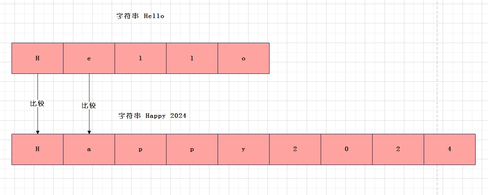

# 前言

> 字符串`String`的比较算法

# 字符串 String 的比较算法

字符串`String`类内部由`char`数组存储数据，因此字符串的大小比较，可通过比较`char`数组里存储的`char`元素实现



---

字符串`String#compareTo()`的比较算法：

- `char`数组A 和 `char`数组B
- 存在任意一数组是空数组，则比较`数组A`、`数组B`的长度
- 不存在空数组，先遍历`数组A`、`数组B`，比较同一索引位的`char`元素大小。当同一索引位元素不相等，返回比较结果，同一索引位元素相等，继续迭代，比较下一索引位元素

```java 
public int compareTo(String anotherString) {
    int len1 = value.length;
    int len2 = anotherString.value.length;
    int lim = Math.min(len1, len2);
    char v1[] = value;
    char v2[] = anotherString.value;

    int k = 0;
    while (k < lim) {
        char c1 = v1[k];
        char c2 = v2[k];
        if (c1 != c2) {
            return c1 - c2;
        }
        k++;
    }
    return len1 - len2;
}
```

> 字符串`String#compareTo()`文档：https://www.matools.com/api/java8