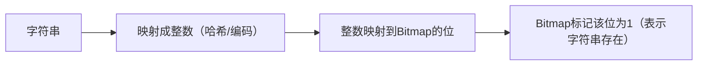

# 前言

<font face="幼圆">

> Bitmap 位图的概念、使用、场景

</font>

# 概念

`[1]`位图的基本原理是使用一个bit位来存放某种状态，适合处理整型的海量数据。通过将整型数据映射到对应的位上，可以有效地判断某个数据是否存在。例如，如果我们需要存储0到14的整数，可以使用15个bit来表示这些整数的存在状态。

**收集 Bitmap 的概念，整理表格如下：**

| 标题                      | 链接                                                               |
|-------------------------|------------------------------------------------------------------|
| Bitmap数据结构—菜鸟日记         | https://www.coonote.com/algorithm-note/bitmap.html               |
| 位图法—百度百科                | https://baike.baidu.com/item/%E4%BD%8D%E5%9B%BE%E6%B3%95/9947453 |
| 布隆过滤器—Hutool工具包         | https://hutool.cn/docs/#/bloomFilter/%E6%A6%82%E8%BF%B0          |
| 大数据量下的集合过滤—Bloom Filter | https://www.cnblogs.com/z941030/p/9218356.html                   |

---

**下面豆包AI描述 Bitmap 的概念：**

1. Bitmap 本质是用二进制位（bit）来表示数据状态的一种数据结构，核心思想是：
   - 每一个二进制位对应一个整数（通常是非负整数）
   - 位的值为 1 表示对应整数存在 / 有效，值为 0 表示不存在 / 无效

2. 可以把 Bitmap 想象成一排开关：
   - 开关的位置 = 整数（比如第 5 个开关对应数字 5）
   - 开关打开（1）= 数字存在，开关关闭（0）= 数字不存在

3. 优点：
   - 极致的空间效率：
     - 普通存储方式（如 int 数组）：存储一个 int 占 4 字节（32 位）
     - Bitmap 方式：32 个整数只占 1 个 int（32 位）
     - 举例：存储 0~10000000 的整数，Bitmap 仅需约 1.2MB（10000000/8/1024/1024），而 int 数组需要约 40MB，空间节省 97%

# 使用

Bitmap 的底层通常用byte[]/int[]/long[]存储（因为编程语言无法直接操作单个 bit，需通过字节 / 整数间接操作），核心计算逻辑如下：

| 操作                 | 计算公式（以 int 数组为例，int 占 32 位） |
| -------------------- | ---------------------------------------- |
| 数组索引             | `index = 数字 / 32`                      |
| 位偏移               | `offset = 数字 % 32`                     |
| 标记存在（置位）     | `array[index] |= (1 << offset)`          |
| 标记不存在（清位）   | `array[index] &= ~(1 << offset)`         |
| 检查是否存在         | `(array[index] & (1 << offset)) != 0`    |

**计算公式解析：**
- index = 数字 / 32
- offset = 数字 % 32

1. 前提 <br>
我们示例中用的是int[]作为 Bitmap 的底层存储，而在 Java（以及绝大多数编程语言）中：
   - 1 个int类型占 32 个二进制位（bit）
   - 数组的每个元素（每个 int）可以管理 32 个数字的状态（0 表示不存在，1 表示存在）
   - 简单说：1 个 int 元素 = 32 个 bit 位 = 能标记 32 个数字

2. 简单说：1 个 int 元素 = 32 个 bit 位 = 能标记 32 个数字 <br>
可以把整个 Bitmap 想象成 “按 32 个数字为一组” 进行分组管理，数组的每个索引对应一个 “数字组”，数字 / 32的本质就是找这个数字属于哪一个组（数组的第几个元素）。<br>
举个具体例子（整数除法，向下取整）：
    
    | 数字范围 | 数字 ÷ 32 的结果（index） | 对应数组元素 | 该元素管理的 bit 位（偏移） |
    | -------- | ------------------------- | ------------ | ---------------------------- |
    | 0 ~ 31   | 0 ÷ 32 = 0，31 ÷ 32 = 0   | bitmapArray[0] | 0~31 位                      |
    | 32 ~ 63  | 32 ÷ 32 = 1，63 ÷ 32 = 1   | bitmapArray[1] | 0~31 位（对应数字 32~63）    |
    | 64 ~ 95  | 64 ÷ 32 = 2，95 ÷ 32 = 2   | bitmapArray[2] | 0~31 位（对应数字 64~95）    |

    更具体的单数字示例：
      - 数字7：7 ÷ 32 = 0 → 属于第 0 组（bitmapArray [0]），再通过7 % 32 = 7找到该组的第 7 位；
      - 数字35：35 ÷ 32 = 1 → 属于第 1 组（bitmapArray [1]），再通过35 % 32 = 3找到该组的第 3 位；
      - 数字64：64 ÷ 32 = 2 → 属于第 2 组（bitmapArray [2]），再通过64 % 32 = 0找到该组的第 0 位。

3. 类比生活场景，更容易理解 <br>
假设你是图书馆管理员，要给 1000 本书贴编号（0~999），但书架的格子每个只能放 32 本书：
   - 第 0 个格子放 0~31 号书；
   - 第 1 个格子放 32~63 号书；
   - 第 2 个格子放 64~95 号书；
   - ...

    现在要找 50 号书，你会先算 50 ÷ 32 = 1 → 去第 1 个格子找，再算 50 % 32 = 18 → 找格子里的第 18 本书。<br>
    这个 “找格子” 的过程，就是 Bitmap 中index = 数字 / 32的逻辑，格子对应数组的索引，格子里的位置对应位偏移。

4. 扩展：如果底层用 long 数组呢？<br>
如果用long[]（1 个 long 占 64 位），索引计算就变成 index = 数字 / 64，原理完全一致 —— 只是每个数组元素能管理的数字数量从 32 个变成了 64 个。

---

## 代码示例

实现一个简单的 Bitmap 解析 / 操作类
```java 
public class Bitmap {
    // 底层存储：int数组，每个int占32位
    private int[] bitmapArray;
    // Bitmap能存储的最大数字
    private int maxNum;

    /**
     * 初始化Bitmap
     * @param maxNum 要存储的最大数字
     */
    public Bitmap(int maxNum) {
        this.maxNum = maxNum;
        // 计算需要的int数组长度：(maxNum / 32) + 1（向上取整）
        this.bitmapArray = new int[(maxNum / 32) + 1];
    }

    /**
     * 标记数字存在（置位）
     */
    public void set(int num) {
        // 边界检查
        if (num < 0 || num > maxNum) {
            throw new IllegalArgumentException("数字超出Bitmap范围");
        }
        int index = num / 32;    // 计算数组索引
        int offset = num % 32;   // 计算位偏移
        bitmapArray[index] |= (1 << offset); // 置位（通过位或操作）
    }

    /**
     * 标记数字不存在（清位）
     */
    public void clear(int num) {
        if (num < 0 || num > maxNum) {
            throw new IllegalArgumentException("数字超出Bitmap范围");
        }
        int index = num / 32;
        int offset = num % 32;
        bitmapArray[index] &= ~(1 << offset); // 清位（通过位与+取反）
    }

    /**
     * 检查数字是否存在
     */
    public boolean contains(int num) {
        if (num < 0 || num > maxNum) {
            return false;
        }
        int index = num / 32;
        int offset = num % 32;
        // 位与操作：结果非0表示该位为1（存在）
        return (bitmapArray[index] & (1 << offset)) != 0;
    }

    /**
     * 遍历所有存在的数字（解析Bitmap）
     */
    public void traverse() {
        System.out.println("Bitmap中存在的数字：");
        for (int i = 0; i <= maxNum; i++) {
            if (contains(i)) {
                System.out.print(i + " ");
            }
        }
        System.out.println();
    }

    // 测试
    public static void main(String[] args) {
        // 初始化Bitmap，最大存储数字为20
        Bitmap bitmap = new Bitmap(20);
        
        // 标记数字存在
        bitmap.set(3);
        bitmap.set(7);
        bitmap.set(15);
        bitmap.set(20);
        
        // 检查数字是否存在
        System.out.println("数字7是否存在：" + bitmap.contains(7)); // true
        System.out.println("数字8是否存在：" + bitmap.contains(8)); // false
        
        // 清位（标记数字15不存在）
        bitmap.clear(15);
        
        // 解析并遍历Bitmap
        bitmap.traverse(); // 输出：3 7 20
    }
}
```

**代码关键解析：**
- 初始化：根据最大存储数字计算 int 数组长度，确保能容纳所有位
- 置位（set）：通过 1 << offset 生成仅目标位为 1 的掩码，再通过|=将目标位设为 1
- 清位（clear）：通过~(1 << offset)生成仅目标位为 0 的掩码，再通过&=将目标位设为 0
- 检查存在（contains）：通过&操作判断目标位是否为 1
- 遍历解析：逐个检查每一位的状态，输出所有为 1 的位对应的数字

# 场景

- 海量数据去重：比如统计网站 UV（独立访客），用用户 ID 映射到 Bitmap，快速去重；
- 快速存在性判断：比如判断某个手机号 / 用户 ID 是否在黑名单中；
- 集合运算：快速计算两个集合的交集、并集（通过位与、位或操作）；
- 布隆过滤器底层：布隆过滤器的核心就是多个 Bitmap 的组合，用于海量数据的快速判重（允许少量误判）。

# 扩展

## Bitmap位图如何保存字符串？

核心思路是先把字符串映射成整数，再用 Bitmap 标记这些整数的状态—— 因为 Bitmap 本身只能直接操作二进制位（对应整数），无法直接存储字符串，必须通过 “字符串→整数” 的映射完成。

**核心逻辑：字符串 → 整数 → Bitmap <br>**
保存字符串的本质不是 “存储字符串本身”，而是 “标记字符串是否存在”（这也是 Bitmap 的核心用途），完整流程如下：



**关键说明：**
- Bitmap无法存储原始字符串，只能记录 “某个字符串是否出现过”；
- 映射的核心是哈希函数（也可以用简单的编码累加），目的是给每个字符串分配一个唯一 / 近似唯一的整数标识。

**常用的字符串 → 整数映射方式：哈希函数（适合长字符串、海量场景）：<br>**
用成熟的哈希函数（如 CRC32、MD5、SHA-1，或语言内置的 hashCode）将字符串转换成固定长度的整数，是工业界最常用的方式。
- 优点：冲突概率低（不同字符串映射到同一整数的概率小）；
- 缺点：哈希函数存在 “哈希冲突”（极少数情况不同字符串会生成相同整数），需结合布隆过滤器优化。

**代码示例：**<br>
实现 Bitmap 保存 / 判断字符串，核心是 “字符串→hashCode→Bitmap”，并处理 hashCode 为负数的情况：

```java 
public class StringBitmap {
    // 底层Bitmap存储（int数组）
    private int[] bitmapArray;
    // Bitmap的最大映射范围（避免整数过大）
    private int maxRange;

    /**
     * 初始化
     * @param maxRange 哈希值的最大范围（建议设为2^20=1048576，兼顾效率和冲突）
     */
    public StringBitmap(int maxRange) {
        this.maxRange = maxRange;
        this.bitmapArray = new int[(maxRange / 32) + 1];
    }

    /**
     * 核心：字符串转整数（哈希）
     */
    private int stringToInt(String str) {
        if (str == null || str.isEmpty()) {
            throw new IllegalArgumentException("字符串不能为空");
        }
        // 1. 获取字符串的hashCode（可能为负数）
        int hashCode = str.hashCode();
        // 2. 转成非负数（避免数组索引越界）
        int positiveHash = Math.abs(hashCode);
        // 3. 取模限制在maxRange内，避免整数过大
        return positiveHash % maxRange;
    }

    /**
     * 保存字符串（标记存在）
     */
    public void add(String str) {
        int num = stringToInt(str);
        int index = num / 32;
        int offset = num % 32;
        // 置位：标记该整数对应的位为1
        bitmapArray[index] |= (1 << offset);
    }

    /**
     * 判断字符串是否已保存（存在性检查）
     */
    public boolean contains(String str) {
        int num = stringToInt(str);
        int index = num / 32;
        int offset = num % 32;
        // 检查该位是否为1
        return (bitmapArray[index] & (1 << offset)) != 0;
    }

    // 测试
    public static void main(String[] args) {
        StringBitmap sb = new StringBitmap(1048576); // 最大范围1048576
        
        // 保存字符串
        sb.add("hello");
        sb.add("bitmap");
        sb.add("java");
        
        // 检查存在性
        System.out.println("是否包含hello：" + sb.contains("hello")); // true
        System.out.println("是否包含world：" + sb.contains("world")); // false
        System.out.println("是否包含java：" + sb.contains("java"));   // true
    }
}
```

**代码关键解析：**
- 1、stringToInt 方法：
  - 先用hashCode()把字符串转成整数，解决 “字符串→整数” 的核心问题；
  - 用Math.abs()转成非负数（因为 hashCode 可能为负，数组索引不能为负）；
  - 用% maxRange限制整数范围，避免 Bitmap 数组过大。 
- 2、add 方法：本质是把字符串对应的整数在 Bitmap 中置位，标记 “该字符串存在”；
- 3、contains 方法：检查字符串对应的整数在 Bitmap 中是否为 1，判断 “是否保存过该字符串”。

---

**解决哈希冲突：布隆过滤器（进阶）：**<br>
上面的实现存在哈希冲突问题：比如两个不同的字符串（如"Aa"和"BB"），它们的 hashCode 可能相同，导致 Bitmap 误判 “两个字符串都存在”。<br>
解决方法是布隆过滤器（Bitmap 的进阶应用）：
- 用多个不同的哈希函数（如 CRC32、MD5、SHA-1）把同一个字符串转换成多个整数；
- 在 Bitmap 中把这些整数对应的位都置为 1；
- 检查时，只有所有位都为 1，才认为字符串存在，大幅降低冲突概率。

**示例（简化版布隆过滤器核心逻辑）：**
```java 
// 多个哈希函数
private int hash1(String str) { /* CRC32哈希 */ }
private int hash2(String str) { /* MD5哈希取低32位 */ }
private int hash3(String str) { /* SHA-1哈希取低32位 */ }

// 添加字符串：多个哈希值都置位
public void add(String str) {
    int num1 = hash1(str) % maxRange;
    int num2 = hash2(str) % maxRange;
    int num3 = hash3(str) % maxRange;
    // 三个位都置1
    setBit(num1);
    setBit(num2);
    setBit(num3);
}

// 检查字符串：所有位都为1才返回true
public boolean contains(String str) {
    int num1 = hash1(str) % maxRange;
    int num2 = hash2(str) % maxRange;
    int num3 = hash3(str) % maxRange;
    return getBit(num1) && getBit(num2) && getBit(num3);
}
```

**注意事项：**
- Bitmap不存储原始字符串：只能判断 “是否存在”，无法从 Bitmap 中还原出原始字符串；
- 哈希范围选择：maxRange越大，冲突概率越低，但 Bitmap 占用的内存也越大（需权衡）；
- 适用场景：海量字符串的存在性判断（如黑名单、URL 去重、缓存穿透防护），不适合需要存储字符串内容的场景。

**总结：**
- Bitmap 保存字符串的核心是字符串→整数（哈希 / 编码）→ Bitmap 置位，本质是标记字符串的存在性，而非存储字符串本身；
- 基础实现用单个哈希函数即可，需处理哈希值为负和范围过大的问题；
- 进阶场景用布隆过滤器（多哈希函数 + Bitmap）降低哈希冲突概率，这是工业界的主流方案。


# 资料

[[1] 菜鸟日记—BitMap数据结构](https://www.coonote.com/algorithm-note/bitmap.html) <br>


