###### *Java* 中的命名规范

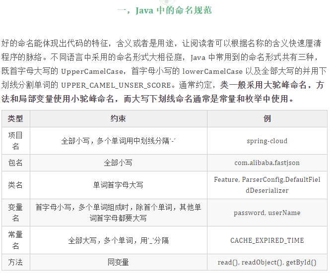

###### 包命名

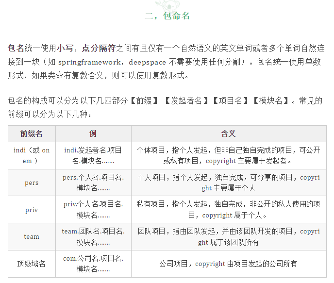

###### 类命名

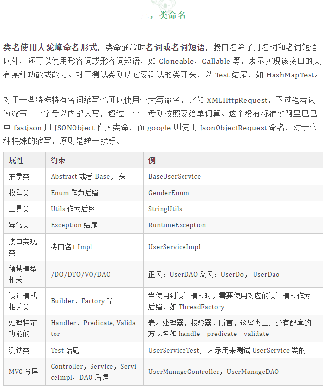

###### 方法

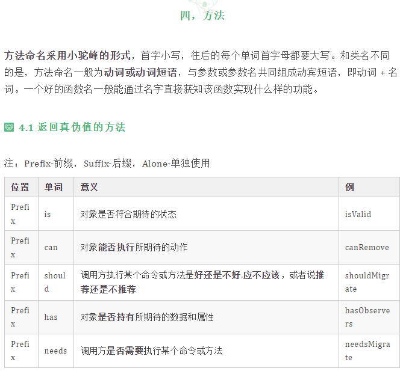

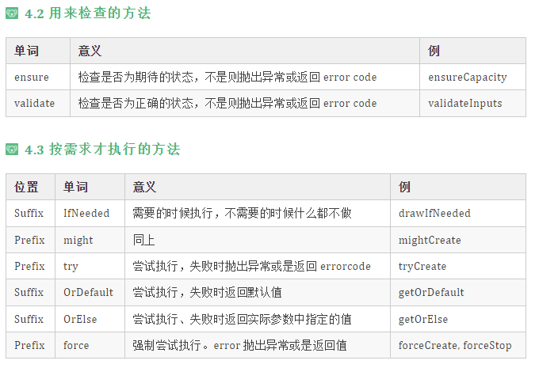

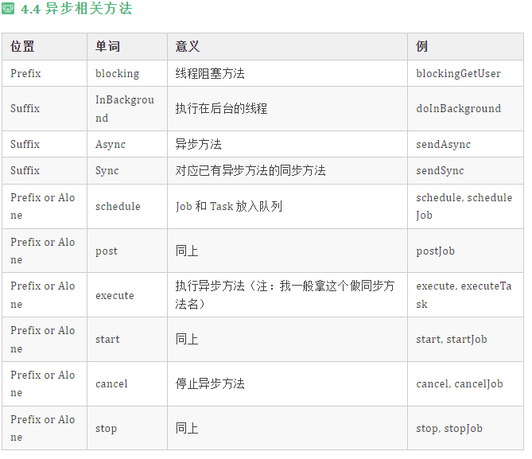

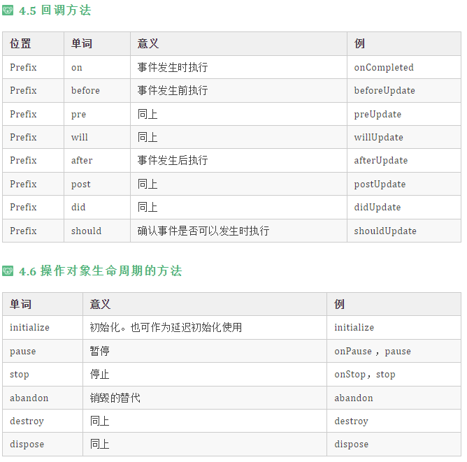

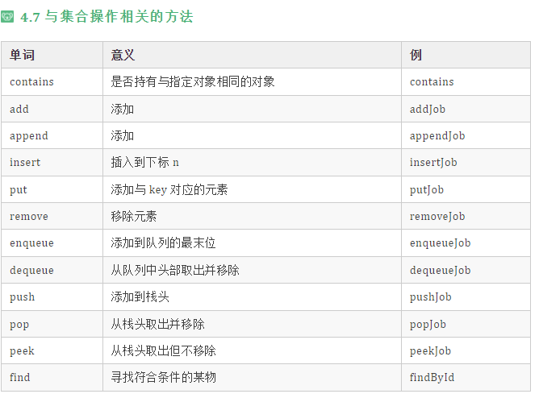

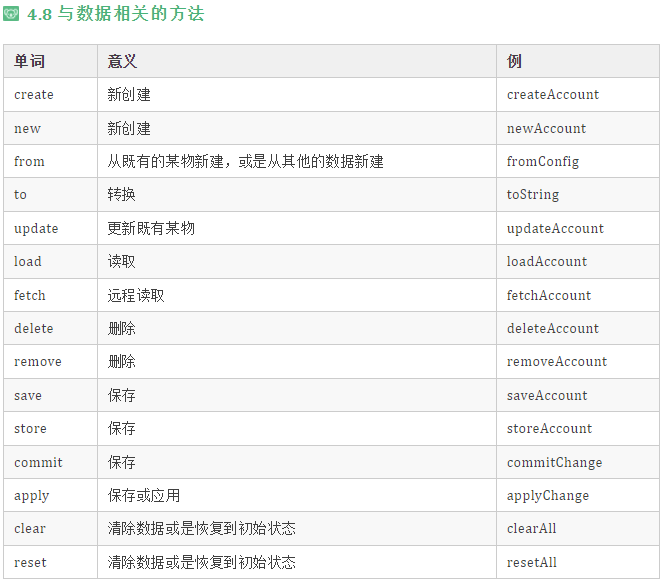

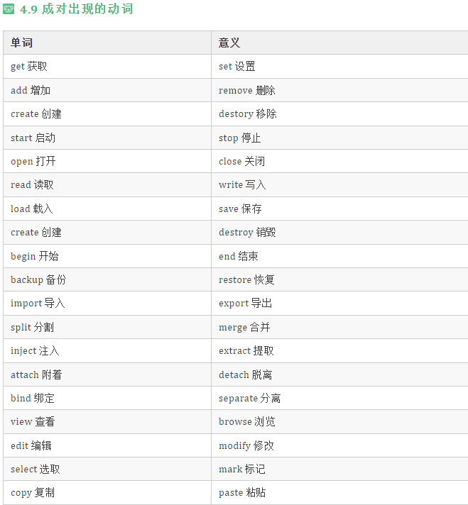

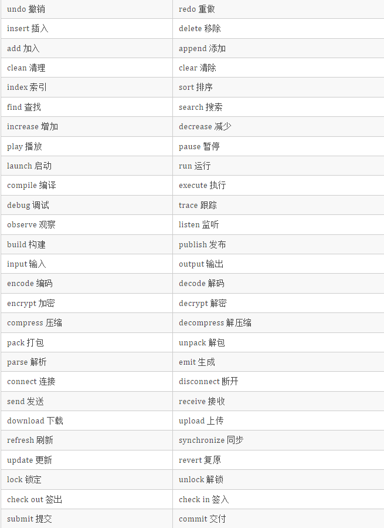

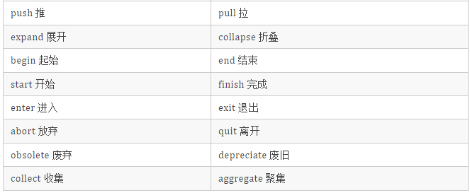

###### 变量&常量命名

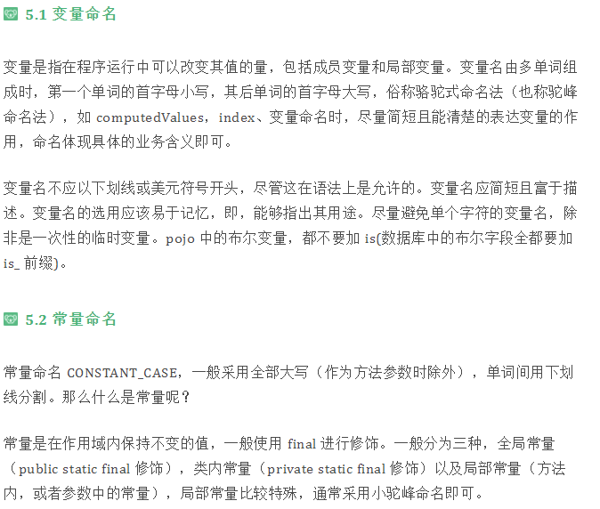

``` java

publicclass HelloWorld {

    /**
     * 局部常量(正例)
     */
    publicstaticfinallong USER_MESSAGE_CACHE_EXPIRE_TIME = 3600;

      /**
     * 局部常量(反例，命名不清晰）
     */
    publicstaticfinallong MESSAGE_CACHE_TIME = 3600;

    /**
     * 全局常量
     */
    privatestaticfinal String ERROR_MESSAGE = " error message";

    /**
     * 成员变量
     */
    privateint currentUserId;

    /**
     * 控制台打印 {@code message} 信息
     *
     * @param message 消息体，局部常量
     */
    public void sayHello(final String message){
        System.out.println("Hello world!");
    }
}

```

> 常量一般都有自己的业务含义,不要害怕长度过长而进行省略或者缩写。如，用户消息缓存过期时间的表示，那种方式更佳清晰，交给你来评判。

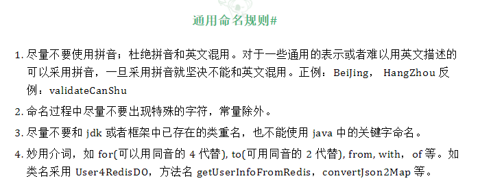

###### 代码注解

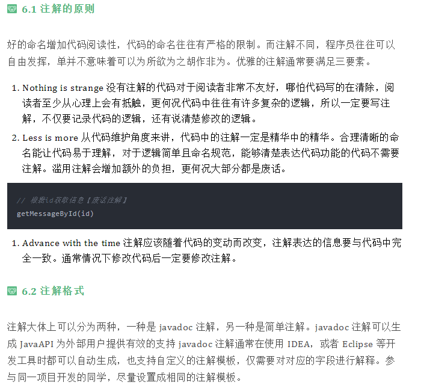

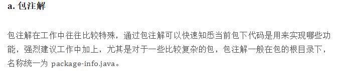

``` java

/**
 * 落地也质量检测
 * 1. 用来解决什么问题
 * 对广告主投放的广告落地页进行性能检测，模拟不同的系统，如Android，IOS等; 模拟不同的网络：2G，3G，4G，wifi等
 *
 * 2. 如何实现
 * 基于chrome浏览器，用chromedriver驱动浏览器，设置对应的网络，OS参数，获取到浏览器返回结果。
 *
 * 注意：网络环境配置信息{@link cn.mycookies.landingpagecheck.meta.NetWorkSpeedEnum}目前使用是常规速度，可以根据实际情况进行调整
 *
 * @author cruder
 * @time 2019/12/7 20:3 下午
 */
package cn.mycookies.landingpagecheck;

```

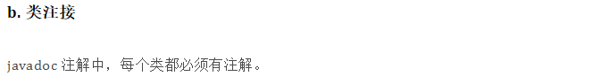

``` java

/**
* Copyright (C), 2019-2020, Jann  balabala...
*
* 类的介绍：这是一个用来做什么事情的类，有哪些功能，用到的技术.....
*
* @author   类创建者姓名 保持对齐
* @date     创建日期 保持对齐
* @version  版本号 保持对齐
*/

```

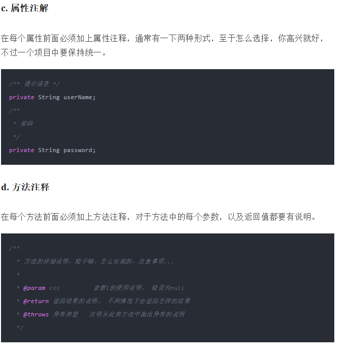

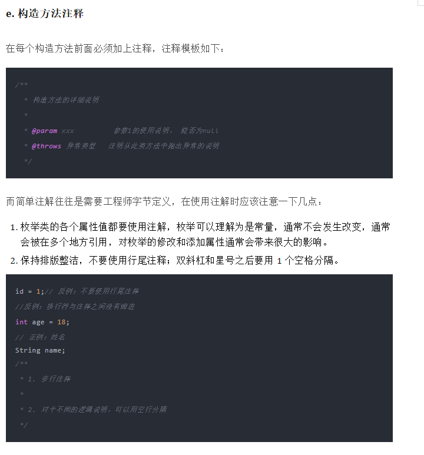