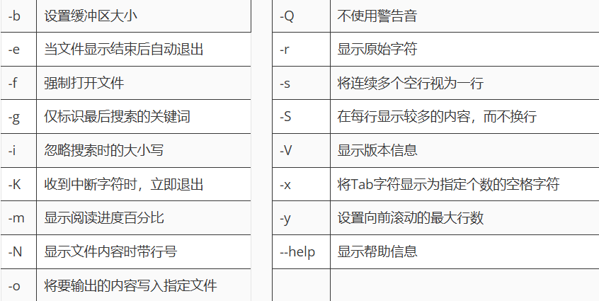

# 前言

> less命令 — 分页显示文件内容

# less命令

## 语法格式

`less`语法格式：less 参数 文件名

常用参数：



---

基本操作：

- 使用空格键（Space）向下翻页
- 使用Page Up和Page Down键进行整屏翻页
- 使用上下方向键进行逐行滚动
- 输入`/关键词`进行内容搜索
- 输入`?关键词`进行反向搜索
- 输入`:n`跳转到第n行
- 输入`:q`退出less查看
- 输入`:g`跳转到文件开头
- 输入`:G`跳转到文件结尾

> 参考：[掌握Linux more less命令，轻松阅读长文本](https://www.linuxcool.com/zwlmlqsydzwb)

## 参考示例

分页查看指定文件的内容：

```shell
[root@linuxcool ~]# less File.cfg
```

---

分页查看指定文件的内容及行号：

```shell
[root@linuxcool ~]# less -N File.cfg
```

---

分页显示指定命令的输出结果：

```shell
[root@linuxcool ~]# history | less
```

