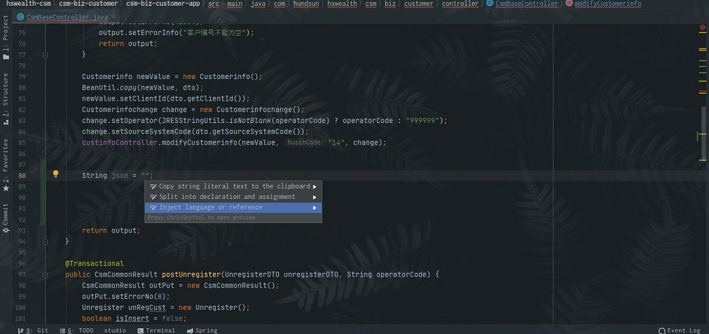
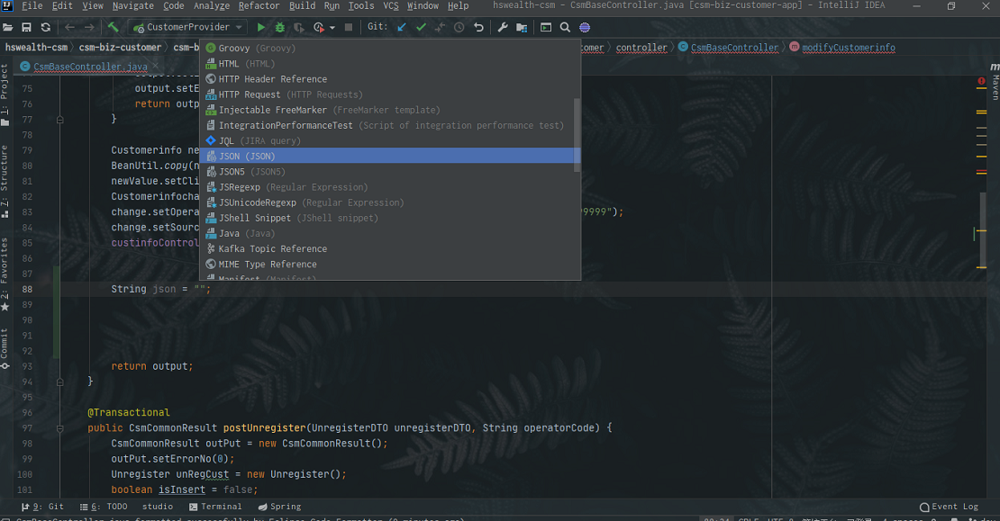
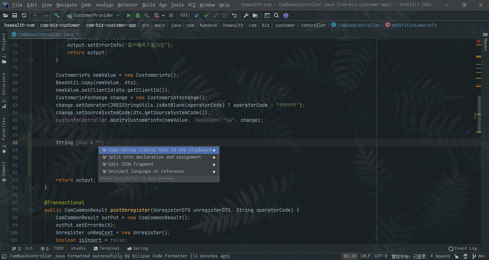
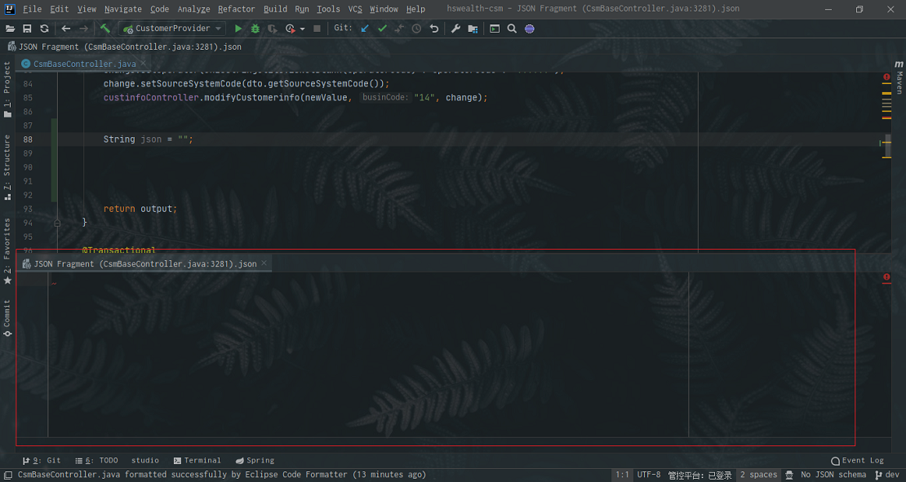
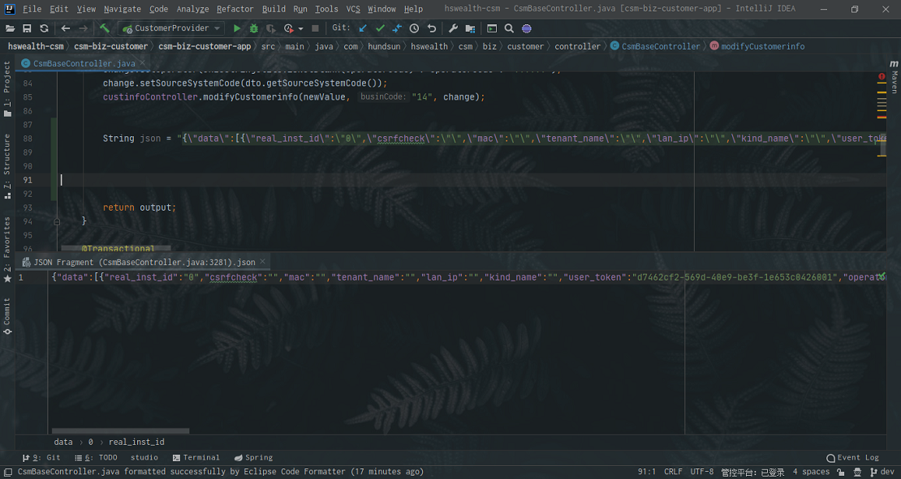

如果你使用Idea在编写Json字符串的时候，然后要一个个' \\ '去转义双引号的话，就实在太不应该了，又烦又容易出错，在IDEA可以使用Inject language帮我们自动转义双引号。

先将焦点定位到双引号里面，使用`alt + enter`快捷键弹出*inject language*视图，并选中*Inject language or reference*。

选择后，切记，要直接按下`enter`回车键，才能弹出*inject language*列表，在列表中选择*Json*组件。

选择完后，鼠标焦点自动会定位在双引号里面，这个时候你再次使用`alt + enter`就可以看到*Json*组件

选中*Edit JSON Fragment*并回车，就可以看到编辑Json文件的视图了

把准备好的*Json*格式的*Json*字符串粘贴进去，自动转义字符，效果如下

可以看到*IDEA*帮我们自动转义双引号了，如果要退出编辑*Json*信息的视图，只需要使用`ctrl + F4`快捷键即可