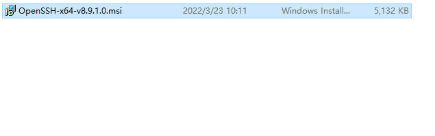
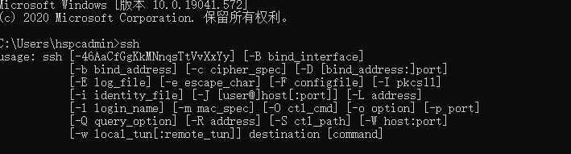
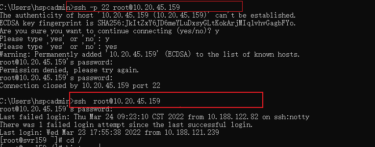

###### 下载 *OpenSSH*

> *OpenSSH* 是一款用于远程登录的连接工具，它使用 *SSH* 协议。 它会加密客户端与服务器之间的所有流量，从而遏止窃听、连接劫持和其他攻击

> 从 *GitHub* 存储库下载 *OpenSSH*  https://github.com/PowerShell/OpenSSH-Portable

###### 安装 *OpenSSH*

> 验证是否安装成功

###### *OpenSSH* 连接服务器

> ssh -p端口 账户@ip地址
> 或者
> ssh 账户@ip地址

