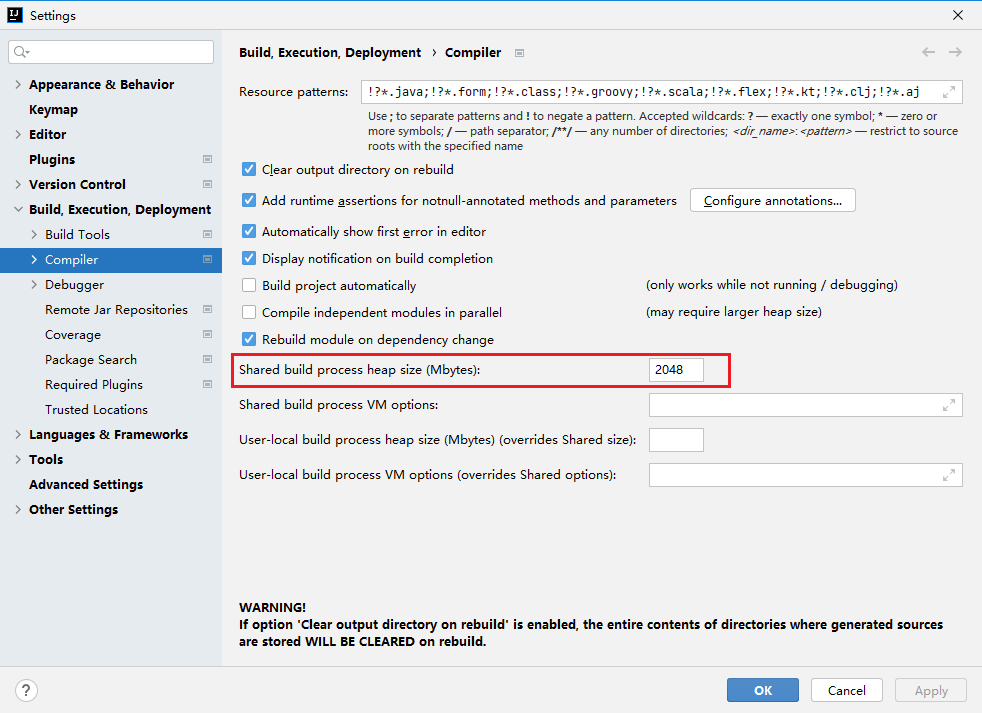

# 背景

因`idea`编译工程缓慢，尝试调整`-Xms -Xmx`参数，修改`idea64.exe.vmoptions`文件配置，问题是解决掉了，结果第二天点击`idea`启动不了

# 解决

恢复`C`盘下`idea64.exe.vmoptions`配置和`idea`安装目录`bin`下的`idea64.exe.vmoptions`配置

!> `C`盘配置路径：`C:\Users\hspcadmin\AppData\Roaming\JetBrains\IdeaIC2021.2\idea64.exe.vmoptions`

# idea编译慢解决

> Shared build process heap size (Mbytes) 共享构建过程堆大小(兆字节)

