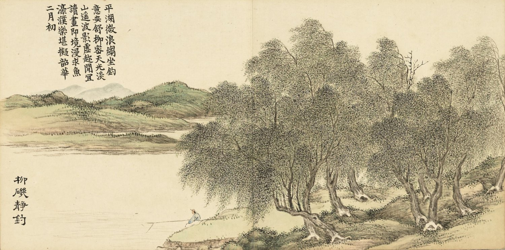

📖 书湖阴先生壁

_王安石〔宋代〕_

_🏷️ 原文：_

&nbsp;&nbsp; 茅檐长扫净无苔，花木成畦手自栽。  
&nbsp;&nbsp; 一水护田将绿绕，两山排闼送青来。

_🏷️ 译文：_

&nbsp;&nbsp; 茅舍庭院由于经常打扫，洁净得没有一丝青苔，花木规整成行成垄都是主人亲自栽种的。  
&nbsp;&nbsp; 庭院外一条小河环绕着大片碧绿的禾苗，两座山峰仿佛要推开门，给主人送上满山的青翠。

--- 

