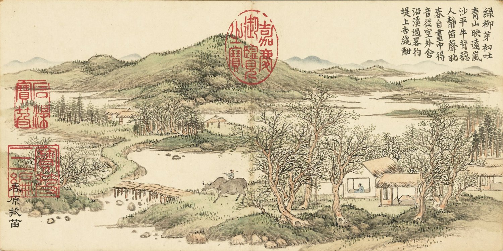

📖 子曰：要盟也，神不听

_司马迁《史记 — 孔子世家》_

_🏷️ 原文：_

过蒲，会公叔氏以蒲畔，蒲人止孔子。
弟子有公良孺者，以私车五乘从孔子。
其为人长贤，有勇力，谓曰：“吾昔从夫子遇难於匡，今又遇难於此，命也已。吾与夫子再罹难，宁斗而死。”
斗甚疾。
蒲人惧，谓孔子曰：“苟毋適卫，吾出子。” 
与之盟，出孔子东门。
孔子遂適卫。
子贡曰：“盟可负邪？” 
孔子曰：“要盟也，神不听。”

_🏷️ 译文：_

孔子路过一个叫蒲的地方，正好遇上公叔氏据蒲反叛卫国，蒲人扣留了孔子。
孔子的弟子中有个叫公良孺的，自己带了五辆车子跟随孔子周游各地。
他这个人身材高大，有才德，且有勇力，对孔子说：“我从前跟随老师周游在匡地遇到危难，如今又在这里遇到危难，这是命里注定的吧。我和老师再一次遭逢灾难，可搏斗而死。”
公良孺跟蒲人打得很激烈，蒲人害怕了，对孔子说：“如果你不到卫国去，我就放你们走。”
孔子与他们订立了盟约，这才放孔子他们从东门出去。
孔子于是到了卫国。
子贡说：“盟约可以违背吗？”孔子说：“在要挟下订立的盟约，神是不会理睬的。”

--- 

